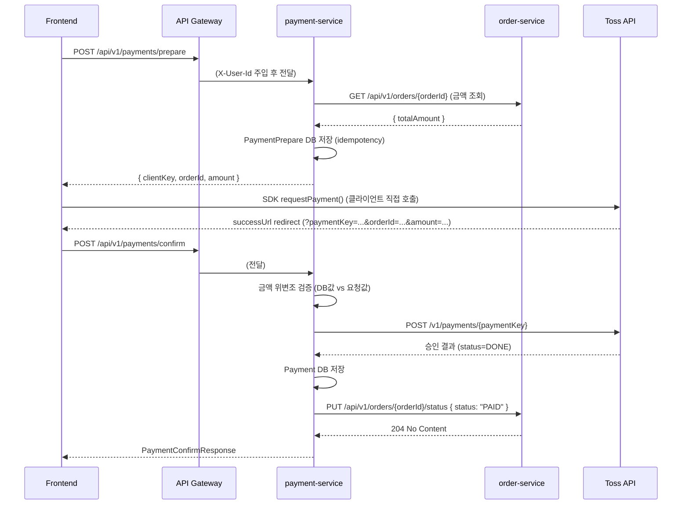

# 02_IMPLEMENTATION — 결제 서비스

> **대상 서비스**: `jym-payment-service`  
> **포트**: 8084  
> **DB**: `jym_payment_db` (MySQL)  
> **역할**: 결제 준비(prepare), 결제 승인(confirm), 결제 취소(cancel) 처리. Toss Payments API와 통신하며 결제 후 `jym-order-service`에 주문 상태를 업데이트합니다.

---

## 1. 프로젝트 설정

| 항목 | 값 |
|---|---|
| 모듈명 | `jym-payment-service` |
| 그룹 | `jymusic` |
| Java | 21 |
| Spring Boot | 4.0.3 |
| 서버 포트 | 8084 |
| 데이터베이스 | `jym_payment_db` |

### `build.gradle`

```groovy
plugins {
    id 'java'
    id 'org.springframework.boot' version '4.0.3'
    id 'io.spring.dependency-management' version '1.1.7'
}

group = 'jymusic'
version = '0.0.1-SNAPSHOT'

java {
    toolchain {
        languageVersion = JavaLanguageVersion.of(21)
    }
}

dependencies {
    implementation 'org.springframework.boot:spring-boot-starter-data-jpa'
    implementation 'org.springframework.boot:spring-boot-starter-security'
    implementation 'org.springframework.boot:spring-boot-starter-webmvc'
    implementation 'org.springframework.boot:spring-boot-starter-validation'
    implementation 'org.springdoc:springdoc-openapi-starter-webmvc-ui:2.8.5'
    compileOnly 'org.projectlombok:lombok'
    developmentOnly 'org.springframework.boot:spring-boot-devtools'
    runtimeOnly 'com.mysql:mysql-connector-j'
    annotationProcessor 'org.projectlombok:lombok'
    testImplementation 'org.springframework.boot:spring-boot-starter-test'
    testImplementation 'org.springframework.security:spring-security-test'
    testRuntimeOnly 'org.junit.platform:junit-platform-launcher'
}

tasks.named('test') {
    useJUnitPlatform()
}
```

---

## 2. 패키지 구조

```
src/main/java/jymusic/jym_payment_service/
├── JymPaymentServiceApplication.java
├── client/
│   ├── OrderClient.java               # order-service HTTP 클라이언트
│   └── TossPaymentsClient.java        # Toss Payments API 클라이언트
├── common/
│   └── GlobalErrorHandler/
│       ├── GlobalException.java
│       └── GlobalExceptionHandler.java
├── config/
│   ├── AppConfig.java                 # RestClient 빈 등록 (orderRestClient)
│   ├── JpaConfig.java                 # JPA Auditing 활성화
│   └── SecurityConfig.java
├── controller/
│   └── PaymentController.java
├── domain/
│   ├── entity/
│   │   ├── BaseTimeEntity.java
│   │   ├── Payment.java
│   │   ├── PaymentMethod.java
│   │   ├── PaymentPrepare.java
│   │   └── PaymentStatus.java
│   └── repository/
│       ├── PaymentPrepareRepository.java
│       └── PaymentRepository.java
├── dto/
│   ├── request/
│   │   ├── PaymentCancelRequest.java
│   │   ├── PaymentConfirmRequest.java
│   │   └── PaymentPrepareRequest.java
│   └── response/
│       ├── PaymentCancelResponse.java
│       ├── PaymentConfirmResponse.java
│       ├── PaymentDetailResponse.java
│       └── PaymentPrepareResponse.java
├── filter/
│   └── GatewayAuthenticationFilter.java
└── service/
    └── PaymentService.java
```

---

## 3. 도메인 엔티티

### `BaseTimeEntity.java`

```java
@MappedSuperclass
@EntityListeners(AuditingEntityListener.class)
@Getter
public abstract class BaseTimeEntity {

    @CreatedDate
    @Column(nullable = false, updatable = false)
    private LocalDateTime createdAt;

    @LastModifiedDate
    @Column(nullable = false)
    private LocalDateTime updatedAt;
}
```

> `JpaConfig.java`에 `@EnableJpaAuditing`을 배치하여 단일 책임 원칙을 준수합니다.

### `PaymentStatus.java`

```java
public enum PaymentStatus {
    READY,      // 결제 준비 (prepare 완료)
    DONE,       // 결제 승인 완료
    CANCELED,   // 결제 취소 완료
    FAILED      // 결제 실패
}
```

### `PaymentMethod.java`

```java
public enum PaymentMethod {
    CARD,           // 카드
    VIRTUAL_ACCOUNT,// 가상계좌
    TRANSFER,       // 계좌이체
    MOBILE_PHONE    // 핸드폰 소액결제
}
```

### `PaymentPrepare.java`

결제 준비 시점에 idempotency key(orderId + amount)를 저장합니다.

```java
@Entity
@Table(name = "payment_prepares")
@Getter
@NoArgsConstructor(access = AccessLevel.PROTECTED)
@Builder
@AllArgsConstructor
public class PaymentPrepare extends BaseTimeEntity {

    @Id @GeneratedValue(strategy = GenerationType.IDENTITY)
    private Long id;

    @Column(nullable = false, unique = true)
    private Long orderId;

    @Column(nullable = false, precision = 12, scale = 0)
    private BigDecimal amount;
}
```

### `Payment.java`

```java
@Entity
@Table(name = "payments")
@Getter
@NoArgsConstructor(access = AccessLevel.PROTECTED)
@Builder
@AllArgsConstructor
public class Payment extends BaseTimeEntity {

    @Id @GeneratedValue(strategy = GenerationType.IDENTITY)
    private Long id;

    @Column(nullable = false)
    private Long memberId;

    @Column(nullable = false, unique = true)
    private Long orderId;

    @Column(nullable = false, length = 200)
    private String paymentKey;  // Toss Payments에서 발급한 키

    @Column(nullable = false, length = 200)
    private String orderName;

    @Enumerated(EnumType.STRING)
    @Column(nullable = false, length = 30)
    private PaymentStatus status;

    @Enumerated(EnumType.STRING)
    @Column(nullable = false, length = 30)
    private PaymentMethod method;

    @Column(nullable = false, precision = 12, scale = 0)
    private BigDecimal amount;

    public void cancel() {
        this.status = PaymentStatus.CANCELED;
    }
}
```

---

## 4. DTO 설계

### Request DTO

```java
// PaymentPrepareRequest.java
@Getter @NoArgsConstructor
public class PaymentPrepareRequest {
    @NotNull(message = "주문 ID는 필수입니다.")
    private Long orderId;
    // amount는 서버에서 order-service를 통해 자체 조회하므로 클라이언트 입력 불필요
}

// PaymentConfirmRequest.java
@Getter @NoArgsConstructor
public class PaymentConfirmRequest {
    @NotBlank(message = "paymentKey는 필수입니다.")
    private String paymentKey;      // Toss SDK가 successUrl로 전달한 키

    @NotNull(message = "orderId는 필수입니다.")
    private Long orderId;

    @NotNull(message = "amount는 필수입니다.")
    private BigDecimal amount;      // 위변조 검증용 (DB값과 비교)
}

// PaymentCancelRequest.java
@Getter @NoArgsConstructor
public class PaymentCancelRequest {
    @NotNull(message = "주문 ID는 필수입니다.")
    private Long orderId;

    @NotBlank(message = "취소 사유는 필수입니다.")
    private String cancelReason;
}
```

### Response DTO

```java
// PaymentPrepareResponse.java
@Getter @Builder
public class PaymentPrepareResponse {
    private Long orderId;
    private BigDecimal amount;
    private String clientKey;   // 프론트가 Toss SDK 초기화에 사용할 client key
}

// PaymentConfirmResponse.java
@Getter @Builder
public class PaymentConfirmResponse {
    private Long orderId;
    private String paymentKey;
    private String status;
    private BigDecimal amount;
    private String method;
}

// PaymentCancelResponse.java
@Getter @Builder
public class PaymentCancelResponse {
    private Long orderId;
    private String paymentKey;
    private String cancelReason;
    private String status;
}

// PaymentDetailResponse.java
@Getter @Builder
public class PaymentDetailResponse {
    private Long id;
    private Long orderId;
    private String paymentKey;
    private String orderName;
    private String status;
    private String method;
    private BigDecimal amount;
    private LocalDateTime createdAt;

    public static PaymentDetailResponse from(Payment payment) { ... }
}
```

---

## 5. Repository

```java
// PaymentPrepareRepository.java
public interface PaymentPrepareRepository extends JpaRepository<PaymentPrepare, Long> {
    Optional<PaymentPrepare> findByOrderId(Long orderId);
    boolean existsByOrderId(Long orderId);
}

// PaymentRepository.java
public interface PaymentRepository extends JpaRepository<Payment, Long> {
    Optional<Payment> findByOrderId(Long orderId);
    Optional<Payment> findByPaymentKey(String paymentKey);
    List<Payment> findAllByMemberIdOrderByCreatedAtDesc(Long memberId);
}
```

---

## 6. Service 레이어

### PaymentService 메서드 목록

| 메서드 | 설명 | 트랜잭션 |
|---|---|---|
| `prepare(memberId, request)` | 결제 준비 (orderId 중복 방지, 금액 idempotency 저장) | write |
| `confirm(memberId, request)` | 결제 승인 (금액 검증 → Toss API → DB 저장 → 주문 상태 PAID) | write |
| `cancel(memberId, request)` | 결제 취소 (Toss API 취소 → DB 업데이트 → 주문 상태 CANCELLED) | write |
| `getPaymentByOrderId(orderId)` | 주문 ID로 결제 내역 조회 | readOnly |

### PaymentService.java

```java
@Service
@RequiredArgsConstructor
@Transactional(readOnly = true)
public class PaymentService {

    private final PaymentRepository paymentRepository;
    private final PaymentPrepareRepository paymentPrepareRepository;
    private final OrderClient orderClient;
    private final TossPaymentsClient tossPaymentsClient;

    @Value("${toss.client-key}")
    private String tossClientKey;

    @Transactional
    public PaymentPrepareResponse prepare(Long memberId, PaymentPrepareRequest request) {
        // 1. 이미 결제 준비된 주문 여부 확인 (idempotency)
        if (paymentPrepareRepository.existsByOrderId(request.getOrderId())) {
            PaymentPrepare existing = paymentPrepareRepository.findByOrderId(request.getOrderId()).get();
            return PaymentPrepareResponse.builder()
                    .orderId(existing.getOrderId()).amount(existing.getAmount()).clientKey(tossClientKey).build();
        }

        // 2. order-service에서 주문 금액 조회
        BigDecimal amount = orderClient.getOrderAmount(request.getOrderId());

        // 3. PaymentPrepare 저장 (이후 confirm 시 금액 위변조 검증 기준)
        paymentPrepareRepository.save(PaymentPrepare.builder()
                .orderId(request.getOrderId()).amount(amount).build());

        return PaymentPrepareResponse.builder()
                .orderId(request.getOrderId()).amount(amount).clientKey(tossClientKey).build();
    }

    @Transactional
    public PaymentConfirmResponse confirm(Long memberId, PaymentConfirmRequest request) {
        // 1. prepare 레코드 조회 (이전 prepare 없이 confirm 방지)
        PaymentPrepare prepare = paymentPrepareRepository.findByOrderId(request.getOrderId())
                .orElseThrow(() -> new GlobalException("결제 준비 정보를 찾을 수 없습니다.", "ERR_PAYMENT_PREPARE_NOT_FOUND"));

        // 2. 금액 위변조 검증 (클라이언트 전달 금액 vs DB 저장 금액)
        if (prepare.getAmount().compareTo(request.getAmount()) != 0) {
            throw new GlobalException("결제 금액이 일치하지 않습니다.", "ERR_AMOUNT_MISMATCH");
        }

        // 3. Toss Payments API 승인 요청
        Map<String, Object> tossResponse = tossPaymentsClient.confirmPayment(
                request.getPaymentKey(), request.getOrderId().toString(), request.getAmount());

        String status = (String) tossResponse.get("status");
        String methodStr = (String) tossResponse.get("method");

        // 4. DB에 결제 내역 저장
        Payment payment = Payment.builder()
                .memberId(memberId).orderId(request.getOrderId())
                .paymentKey(request.getPaymentKey()).orderName((String) tossResponse.get("orderName"))
                .status(PaymentStatus.DONE).method(convertPaymentMethod(methodStr))
                .amount(request.getAmount()).build();
        paymentRepository.save(payment);

        // 5. order-service에 주문 상태 PAID로 업데이트
        orderClient.updateOrderStatus(request.getOrderId(), "PAID");

        return PaymentConfirmResponse.builder()
                .orderId(request.getOrderId()).paymentKey(request.getPaymentKey())
                .status(status).amount(request.getAmount()).method(methodStr).build();
    }

    @Transactional
    public PaymentCancelResponse cancel(Long memberId, PaymentCancelRequest request) {
        Payment payment = paymentRepository.findByOrderId(request.getOrderId())
                .orElseThrow(() -> new GlobalException("결제 내역을 찾을 수 없습니다.", "ERR_PAYMENT_NOT_FOUND", HttpStatus.NOT_FOUND));

        // 1. Toss Payments API 취소 요청
        tossPaymentsClient.cancelPayment(payment.getPaymentKey(), request.getCancelReason());

        // 2. DB 상태 취소로 변경
        payment.cancel();

        // 3. order-service에 주문 상태 CANCELLED로 업데이트
        orderClient.updateOrderStatus(request.getOrderId(), "CANCELLED");

        return PaymentCancelResponse.builder()
                .orderId(request.getOrderId()).paymentKey(payment.getPaymentKey())
                .cancelReason(request.getCancelReason()).status(PaymentStatus.CANCELED.name()).build();
    }

    public PaymentDetailResponse getPaymentByOrderId(Long orderId) {
        Payment payment = paymentRepository.findByOrderId(orderId)
                .orElseThrow(() -> new GlobalException("결제 내역을 찾을 수 없습니다.", "ERR_PAYMENT_NOT_FOUND", HttpStatus.NOT_FOUND));
        return PaymentDetailResponse.from(payment);
    }

    private PaymentMethod convertPaymentMethod(String tossMethod) {
        return switch (tossMethod) {
            case "카드" -> PaymentMethod.CARD;
            case "계좌이체" -> PaymentMethod.TRANSFER;
            case "가상계좌" -> PaymentMethod.VIRTUAL_ACCOUNT;
            case "핸드폰" -> PaymentMethod.MOBILE_PHONE;
            default -> PaymentMethod.CARD;
        };
    }
}
```

---

## 7. Controller 레이어

### PaymentController.java

```java
@RestController
@RequestMapping("/api/v1/payments")
@RequiredArgsConstructor
public class PaymentController {

    private final PaymentService paymentService;

    @PostMapping("/prepare")
    public ResponseEntity<PaymentPrepareResponse> prepare(
            @AuthenticationPrincipal String memberId,
            @Valid @RequestBody PaymentPrepareRequest request) {
        return ResponseEntity.ok(paymentService.prepare(Long.parseLong(memberId), request));
    }

    @PostMapping("/confirm")
    public ResponseEntity<PaymentConfirmResponse> confirm(
            @AuthenticationPrincipal String memberId,
            @Valid @RequestBody PaymentConfirmRequest request) {
        return ResponseEntity.ok(paymentService.confirm(Long.parseLong(memberId), request));
    }

    @PostMapping("/cancel")
    public ResponseEntity<PaymentCancelResponse> cancel(
            @AuthenticationPrincipal String memberId,
            @Valid @RequestBody PaymentCancelRequest request) {
        return ResponseEntity.ok(paymentService.cancel(Long.parseLong(memberId), request));
    }

    @GetMapping("/orders/{orderId}")
    public ResponseEntity<PaymentDetailResponse> getPayment(
            @PathVariable Long orderId) {
        return ResponseEntity.ok(paymentService.getPaymentByOrderId(orderId));
    }
}
```

---

## 8. 외부 서비스 클라이언트

### OrderClient.java

```java
@Component
@RequiredArgsConstructor
@Slf4j
public class OrderClient {

    private final RestClient orderRestClient;  // AppConfig에서 baseUrl 설정된 빈

    public BigDecimal getOrderAmount(Long orderId) {
        try {
            Map<String, Object> response = orderRestClient.get()
                    .uri("/api/v1/orders/{orderId}", orderId)
                    .retrieve()
                    .onStatus(HttpStatusCode::is4xxClientError, (req, res) -> {
                        throw new GlobalException("주문을 찾을 수 없습니다.", "ERR_ORDER_NOT_FOUND", HttpStatus.NOT_FOUND);
                    })
                    .body(Map.class);
            return new BigDecimal(response.get("totalAmount").toString());
        } catch (GlobalException e) {
            throw e;
        } catch (Exception e) {
            log.error("order-service 호출 실패: orderId={}", orderId, e);
            throw new GlobalException("주문 정보를 가져오는 중 오류가 발생했습니다.", "ERR_ORDER_SERVICE_UNAVAILABLE", HttpStatus.SERVICE_UNAVAILABLE);
        }
    }

    public void updateOrderStatus(Long orderId, String status) {
        try {
            orderRestClient.put()
                    .uri("/api/v1/orders/{orderId}/status", orderId)
                    .body(Map.of("status", status))
                    .retrieve()
                    .toBodilessEntity();
        } catch (Exception e) {
            log.error("order-service 상태 업데이트 실패: orderId={}, status={}", orderId, status, e);
            throw new GlobalException("주문 상태 업데이트에 실패했습니다.", "ERR_ORDER_STATUS_UPDATE_FAILED", HttpStatus.SERVICE_UNAVAILABLE);
        }
    }
}
```

### TossPaymentsClient.java

```java
@Component
@Slf4j
public class TossPaymentsClient {

    @Value("${toss.api-url:https://api.tosspayments.com}")
    private String apiUrl;

    @Value("${toss.secret-key}")
    private String secretKey;

    private RestClient tossRestClient;

    // secretKey는 @Value 주입 이후에 사용 가능하므로 @PostConstruct로 초기화
    @PostConstruct
    void init() {
        String encoded = Base64.getEncoder().encodeToString((secretKey + ":").getBytes(StandardCharsets.UTF_8));
        this.tossRestClient = RestClient.builder()
                .baseUrl(apiUrl)
                .defaultHeader("Authorization", "Basic " + encoded)
                .defaultHeader("Content-Type", "application/json")
                .build();
    }

    public Map<String, Object> confirmPayment(String paymentKey, String orderId, BigDecimal amount) {
        Map<String, Object> requestBody = Map.of(
                "orderId", orderId,
                "amount", amount
        );
        try {
            return tossRestClient.post()
                    .uri("/v1/payments/{paymentKey}", paymentKey)
                    .body(requestBody)
                    .retrieve()
                    .onStatus(HttpStatusCode::is4xxClientError, (req, res) -> {
                        throw new GlobalException("Toss 결제 승인에 실패했습니다.", "ERR_TOSS_CONFIRM_FAILED");
                    })
                    .body(Map.class);
        } catch (GlobalException e) {
            throw e;
        } catch (Exception e) {
            log.error("Toss 결제 승인 실패: paymentKey={}", paymentKey, e);
            throw new GlobalException("결제 처리 중 오류가 발생했습니다.", "ERR_TOSS_UNAVAILABLE", HttpStatus.SERVICE_UNAVAILABLE);
        }
    }

    public void cancelPayment(String paymentKey, String cancelReason) {
        Map<String, String> requestBody = Map.of("cancelReason", cancelReason);
        try {
            tossRestClient.post()
                    .uri("/v1/payments/{paymentKey}/cancel", paymentKey)
                    .body(requestBody)
                    .retrieve()
                    .toBodilessEntity();
        } catch (Exception e) {
            log.error("Toss 결제 취소 실패: paymentKey={}", paymentKey, e);
            throw new GlobalException("결제 취소 처리 중 오류가 발생했습니다.", "ERR_TOSS_CANCEL_FAILED", HttpStatus.SERVICE_UNAVAILABLE);
        }
    }
}
```

**Toss Payments Basic Auth 방식:**
- `Authorization: Basic base64(secretKey + ":")`
- secretKey 뒤에 콜론(`:`)을 붙이고 Base64 인코딩 (RFC 7617 기본 인증 방식)

---

## 9. 결제 플로우



**취소 플로우:**
```
FE → POST /api/v1/payments/cancel
  → TossPaymentsClient.cancelPayment(paymentKey, cancelReason)
  → Toss POST /v1/payments/{paymentKey}/cancel
  → Payment.cancel() (status=CANCELED)
  → OrderClient.updateOrderStatus(orderId, "CANCELLED")
```

---

## 10. 보안 설정

order-service와 동일하게 `GatewayAuthenticationFilter`가 `X-User-Id` / `X-User-Role` 헤더를 파싱하여 SecurityContext에 등록합니다.

```java
// SecurityConfig.java  — 결제 서비스 특이점
.authorizeHttpRequests(auth -> auth
    .requestMatchers("/swagger-ui/**", "/v3/api-docs/**", "/openapi.yaml").permitAll()
    .anyRequest().authenticated()
)
```

---

## 11. 예외 처리

order-service와 동일한 `GlobalException` / `GlobalExceptionHandler` 패턴 사용.

### 에러 코드 목록

| 코드 | HTTP | 설명 |
|---|---|---|
| `ERR_PAYMENT_PREPARE_NOT_FOUND` | 400 | 결제 준비 레코드 없이 confirm 시도 |
| `ERR_AMOUNT_MISMATCH` | 400 | 결제 금액 위변조 감지 |
| `ERR_PAYMENT_NOT_FOUND` | 404 | 결제 내역 없음 |
| `ERR_TOSS_CONFIRM_FAILED` | 400 | Toss API 결제 승인 거부 |
| `ERR_TOSS_CANCEL_FAILED` | 503 | Toss API 취소 요청 실패 |
| `ERR_TOSS_UNAVAILABLE` | 503 | Toss API 연결 오류 |
| `ERR_ORDER_NOT_FOUND` | 404 | order-service에서 주문을 찾을 수 없음 |
| `ERR_ORDER_SERVICE_UNAVAILABLE` | 503 | order-service 연결 오류 |
| `ERR_ORDER_STATUS_UPDATE_FAILED` | 503 | order-service 상태 업데이트 실패 |

---

## 12. 설정 파일

### `application.properties`

```properties
spring.application.name=jym-payment-service
spring.profiles.active=dev
```

### `application-dev.properties`

```properties
server.port=8084
spring.application.name=jym-payment-service

# Database
spring.datasource.url=jdbc:mysql://218.38.160.152:3306/jym_payment_db?serverTimezone=UTC&characterEncoding=UTF-8
spring.datasource.username=jyjymysql
spring.datasource.password=1234!@
spring.datasource.driver-class-name=com.mysql.cj.jdbc.Driver
spring.jpa.hibernate.ddl-auto=update
spring.jpa.show-sql=true
spring.jpa.properties.hibernate.format_sql=true

# Swagger UI
springdoc.swagger-ui.enabled=true
springdoc.swagger-ui.url=/openapi.yaml
springdoc.swagger-ui.path=/swagger-ui.html
springdoc.api-docs.path=/api-docs

# Toss Payments
toss.api-url=https://api.tosspayments.com
toss.client-key=test_ck_your_client_key_here
toss.secret-key=test_sk_your_secret_key_here

# Order Service URL
services.order.url=http://localhost:8083

# Logging
logging.level.jymusic.jym_payment_service=DEBUG
server.error.include-message=always
```

---

## 13. 단위 테스트 가이드

### 테스트 대상 우선순위

| 우선순위 | 대상 클래스 | 테스트 유형 |
|---|---|---|
| 1 | `PaymentService` | Mockito 단위 테스트 |
| 2 | `TossPaymentsClient` | Mockito 단위 테스트 |

### PaymentServiceTest — 핵심 케이스

| 테스트 메서드 | 검증 내용 |
|---|---|
| `prepare_success` | 정상 prepare → PaymentPrepare DB 저장, clientKey 반환 |
| `prepare_idempotent` | 동일 orderId로 재호출 시 기존 prepare 반환 (중복 저장 없음) |
| `confirm_success` | 정상 confirm → Payment 저장, orderClient.updateOrderStatus("PAID") 호출 |
| `confirm_throwsOnAmountMismatch` | 금액 불일치 → `ERR_AMOUNT_MISMATCH` 예외 |
| `confirm_throwsWhenPrepareNotFound` | prepare 없이 confirm → `ERR_PAYMENT_PREPARE_NOT_FOUND` |
| `cancel_success` | 정상 취소 → payment.cancel() 호출, orderClient.updateOrderStatus("CANCELLED") 호출 |
| `cancel_throwsWhenPaymentNotFound` | 결제 내역 없음 → `ERR_PAYMENT_NOT_FOUND` |

---
