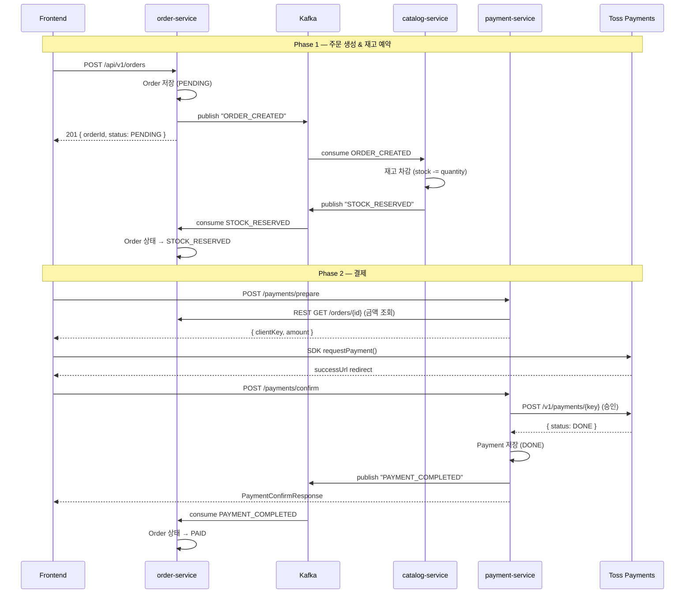
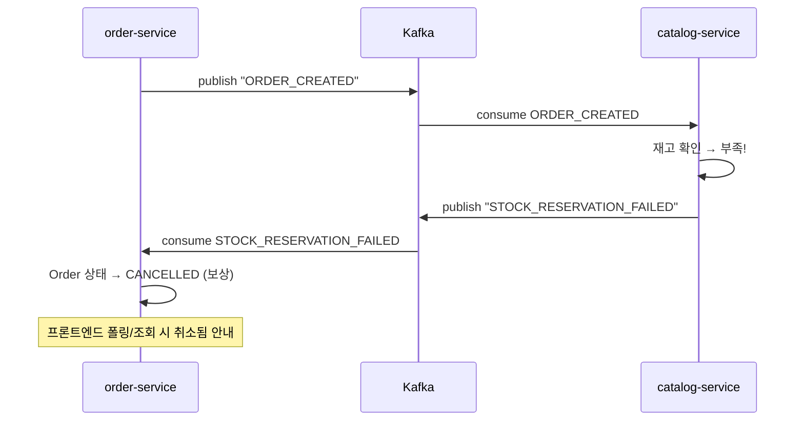
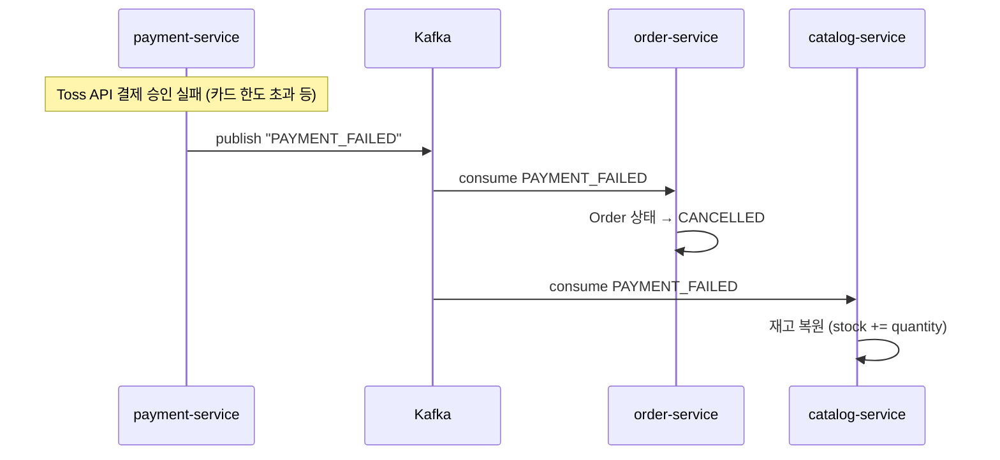
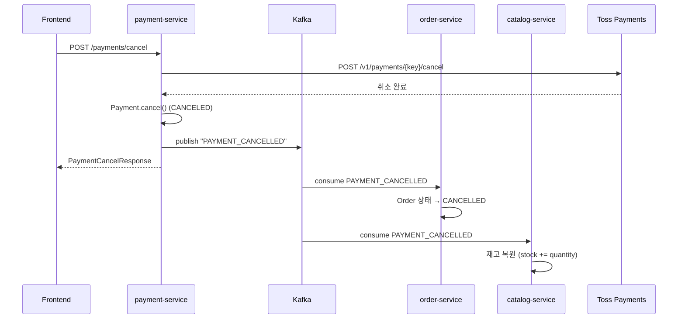

# 02_SAGA_ORDER_PAYMENT — Saga 패턴 구현 스펙

> **목적**: 주문-결제-재고 간 데이터 일관성을 보장하는 Choreography Saga 패턴의 구현 스펙  
> **선행 문서**: `00_MSA_RESILIENCE_GUIDE_KR.md`, `01_KAFKA_INFRASTRUCTURE_SPEC_KR.md`  
> **영향 범위**: `jym-order-service`, `jym-payment-service`, `jym-catalog-service`

---

## 1. 전체 Saga 흐름 개요

### 1.1 주문-결제 Saga (정상 흐름)



### 1.2 보상 흐름 — 재고 예약 실패



### 1.3 보상 흐름 — 결제 실패



### 1.4 보상 흐름 — 결제 취소 (사용자 요청)



---

## 2. 주문 상태 머신 (Order State Machine)

### 2.1 확장된 OrderStatus

기존 상태에 `STOCK_RESERVED`를 추가하여 Saga 단계를 세밀하게 추적합니다.

```java
public enum OrderStatus {
    PENDING,          // 주문 생성, 재고 예약 대기
    STOCK_RESERVED,   // [NEW] 재고 예약 완료, 결제 대기
    PAID,             // 결제 완료
    SHIPPED,          // 발송 완료
    COMPLETED,        // 구매 확정
    CANCELLED         // 취소됨 (보상 트랜잭션 결과 포함)
}
```

### 2.2 상태 전이 규칙

```
                        ┌──────────────────┐
                        │     PENDING      │
                        │  (주문 생성)      │
                        └────────┬─────────┘
                                 │
                    ┌────────────┼────────────┐
                    │ STOCK_RESERVED          │ STOCK_RESERVATION_FAILED
                    ▼                         ▼
           ┌───────────────┐          ┌─────────────┐
           │ STOCK_RESERVED │          │  CANCELLED  │
           │ (재고 확보)     │          │  (재고 부족) │
           └───────┬───────┘          └─────────────┘
                   │
          ┌────────┼────────┐
          │ PAYMENT_COMPLETED│ PAYMENT_FAILED / TIMEOUT
          ▼                  ▼
    ┌──────────┐       ┌─────────────┐
    │   PAID   │       │  CANCELLED  │
    │ (결제 완료)│       │ (결제 실패)  │
    └────┬─────┘       └─────────────┘
         │
         │ SHIPPED
         ▼
    ┌──────────┐
    │  SHIPPED │
    │ (발송)    │
    └────┬─────┘
         │ COMPLETED
         ▼
    ┌──────────┐
    │ COMPLETED│
    │ (확정)    │
    └──────────┘
```

### 2.3 상태 전이 검증 코드

```java
// Order.java 엔티티에 추가

/**
 * 상태 전이 유효성 검증.
 * 유효하지 않은 전이 시 GlobalException 발생.
 */
public void transitionTo(OrderStatus newStatus) {
    if (!isValidTransition(this.status, newStatus)) {
        throw new GlobalException(
            String.format("주문 상태를 %s에서 %s로 변경할 수 없습니다.", this.status, newStatus),
            "ERR_INVALID_ORDER_TRANSITION"
        );
    }
    this.status = newStatus;
}

private boolean isValidTransition(OrderStatus from, OrderStatus to) {
    return switch (from) {
        case PENDING        -> to == OrderStatus.STOCK_RESERVED || to == OrderStatus.CANCELLED;
        case STOCK_RESERVED -> to == OrderStatus.PAID || to == OrderStatus.CANCELLED;
        case PAID           -> to == OrderStatus.SHIPPED || to == OrderStatus.CANCELLED;
        case SHIPPED        -> to == OrderStatus.COMPLETED;
        case COMPLETED, CANCELLED -> false;  // 종료 상태 — 전이 불가
    };
}
```

---

## 3. 서비스별 구현 상세

### 3.1 order-service 변경 사항

#### 3.1.1 OrderService.java — createOrder() 변경

**AS-IS (현재):**
```java
@Transactional
public OrderResponse createOrder(Long memberId, OrderCreateRequest request) {
    // 1. 재고 검증 (REST)
    // 2. 주문 + 아이템 생성
    // 3. 장바구니 비우기
    return OrderResponse.from(savedOrder);
}
```

**TO-BE (변경 후):**
```java
@Transactional
public OrderResponse createOrder(Long memberId, OrderCreateRequest request) {
    // 1. 상품 정보 조회 (REST → catalog-service, Circuit Breaker 적용)
    //    ※ 재고 "검증"만 수행, 차감은 하지 않음 (Kafka 이벤트로 처리)
    List<ItemInfo> infos = new ArrayList<>();
    BigDecimal totalAmount = BigDecimal.ZERO;

    for (OrderItemRequest itemReq : request.getItems()) {
        CatalogClient.ProductInfo info = catalogClient.getProductInfo(itemReq.getProductId());
        // 기본 유효성만 체크 (상품 존재 여부, 판매 가능 여부)
        // ※ 재고 수량 최종 검증은 catalog-service가 이벤트 소비 시 수행
        totalAmount = totalAmount.add(
            info.price().multiply(BigDecimal.valueOf(itemReq.getQuantity()))
        );
        infos.add(new ItemInfo(info, itemReq.getQuantity()));
    }

    // 2. 주문 생성 (PENDING 상태)
    Order order = Order.builder()
            .memberId(memberId)
            .totalAmount(totalAmount)
            .status(OrderStatus.PENDING)
            .build();

    for (ItemInfo i : infos) {
        order.getItems().add(OrderItem.builder()
                .order(order)
                .productId(i.info().productId())
                .productTitle(i.info().title())
                .unitPrice(i.info().price())
                .quantity(i.quantity())
                .build());
    }
    Order savedOrder = orderRepository.save(order);

    // 3. 장바구니 비우기
    cartRepository.findByMemberId(memberId).ifPresent(cart -> {
        cart.getItems().clear();
        cartRepository.save(cart);
    });

    // 4. [NEW] ORDER_CREATED 이벤트 발행
    publishOrderCreatedEvent(savedOrder);

    return OrderResponse.from(savedOrder);
}

/**
 * 주문 생성 이벤트 발행.
 * Kafka로 발행하여 catalog-service가 재고를 예약하도록 트리거.
 */
private void publishOrderCreatedEvent(Order order) {
    OrderCreatedPayload payload = OrderCreatedPayload.builder()
            .orderId(order.getId())
            .memberId(order.getMemberId())
            .totalAmount(order.getTotalAmount())
            .items(order.getItems().stream()
                    .map(item -> OrderItemPayload.builder()
                            .productId(item.getProductId())
                            .productTitle(item.getProductTitle())
                            .unitPrice(item.getUnitPrice())
                            .quantity(item.getQuantity())
                            .build())
                    .toList())
            .build();

    eventPublisher.publish(
            KafkaTopics.ORDER_EVENTS,
            order.getId().toString(),  // Kafka key = orderId
            EventTypes.ORDER_CREATED,
            payload
    );
}
```

#### 3.1.2 OrderEventConsumer.java — [NEW] 이벤트 소비

```java
/**
 * 다른 서비스의 이벤트를 소비하여 주문 상태를 업데이트합니다.
 *
 * 소비 이벤트:
 *   - STOCK_RESERVED       (from catalog-service) → PENDING → STOCK_RESERVED
 *   - STOCK_RESERVATION_FAILED (from catalog-service) → PENDING → CANCELLED
 *   - PAYMENT_COMPLETED    (from payment-service) → STOCK_RESERVED → PAID
 *   - PAYMENT_FAILED       (from payment-service) → STOCK_RESERVED → CANCELLED
 *   - PAYMENT_CANCELLED    (from payment-service) → PAID → CANCELLED
 */
@Component
@RequiredArgsConstructor
@Slf4j
public class OrderEventConsumer {

    private final OrderRepository orderRepository;
    private final EventPublisher eventPublisher;

    // ──────────────────────────────────────────
    // Stock Events 소비
    // ──────────────────────────────────────────

    @KafkaListener(
        topics = KafkaTopics.STOCK_EVENTS,
        groupId = "jym-order-service-group",
        containerFactory = "kafkaListenerContainerFactory"
    )
    public void handleStockEvent(ConsumerRecord<String, EventEnvelope<?>> record) {
        EventEnvelope<?> envelope = record.value();
        log.info("Stock 이벤트 수신: type={}, orderId={}",
                envelope.getEventType(), record.key());

        switch (envelope.getEventType()) {
            case EventTypes.STOCK_RESERVED -> handleStockReserved(envelope);
            case EventTypes.STOCK_RESERVATION_FAILED -> handleStockReservationFailed(envelope);
            default -> log.warn("처리하지 않는 Stock 이벤트 타입: {}", envelope.getEventType());
        }
    }

    private void handleStockReserved(EventEnvelope<?> envelope) {
        StockReservedPayload payload = convertPayload(envelope, StockReservedPayload.class);

        orderRepository.findById(payload.getOrderId()).ifPresentOrElse(
            order -> {
                // 멱등성 체크 — 이미 STOCK_RESERVED 이상이면 무시
                if (order.getStatus() != OrderStatus.PENDING) {
                    log.info("이미 처리된 재고 예약 이벤트, skip: orderId={}, currentStatus={}",
                            payload.getOrderId(), order.getStatus());
                    return;
                }
                order.transitionTo(OrderStatus.STOCK_RESERVED);
                orderRepository.save(order);
                log.info("주문 상태 갱신: orderId={} → STOCK_RESERVED", payload.getOrderId());
            },
            () -> log.error("주문을 찾을 수 없음: orderId={}", payload.getOrderId())
        );
    }

    private void handleStockReservationFailed(EventEnvelope<?> envelope) {
        StockReservationFailedPayload payload =
                convertPayload(envelope, StockReservationFailedPayload.class);

        orderRepository.findById(payload.getOrderId()).ifPresentOrElse(
            order -> {
                if (order.getStatus() == OrderStatus.CANCELLED) {
                    log.info("이미 취소된 주문, skip: orderId={}", payload.getOrderId());
                    return;
                }
                order.transitionTo(OrderStatus.CANCELLED);
                orderRepository.save(order);
                log.info("재고 예약 실패로 주문 취소: orderId={}, 사유=상품 '{}' 재고 부족",
                        payload.getOrderId(), payload.getFailedProductTitle());
            },
            () -> log.error("주문을 찾을 수 없음: orderId={}", payload.getOrderId())
        );
    }

    // ──────────────────────────────────────────
    // Payment Events 소비
    // ──────────────────────────────────────────

    @KafkaListener(
        topics = KafkaTopics.PAYMENT_EVENTS,
        groupId = "jym-order-service-group",
        containerFactory = "kafkaListenerContainerFactory"
    )
    public void handlePaymentEvent(ConsumerRecord<String, EventEnvelope<?>> record) {
        EventEnvelope<?> envelope = record.value();
        log.info("Payment 이벤트 수신: type={}, orderId={}",
                envelope.getEventType(), record.key());

        switch (envelope.getEventType()) {
            case EventTypes.PAYMENT_COMPLETED -> handlePaymentCompleted(envelope);
            case EventTypes.PAYMENT_FAILED -> handlePaymentFailed(envelope);
            case EventTypes.PAYMENT_CANCELLED -> handlePaymentCancelled(envelope);
            default -> log.warn("처리하지 않는 Payment 이벤트 타입: {}", envelope.getEventType());
        }
    }

    @Transactional
    private void handlePaymentCompleted(EventEnvelope<?> envelope) {
        PaymentCompletedPayload payload = convertPayload(envelope, PaymentCompletedPayload.class);

        orderRepository.findById(payload.getOrderId()).ifPresentOrElse(
            order -> {
                if (order.getStatus() == OrderStatus.PAID) {
                    log.info("이미 PAID 상태, skip: orderId={}", payload.getOrderId());
                    return;
                }
                order.transitionTo(OrderStatus.PAID);
                orderRepository.save(order);
                log.info("결제 완료로 주문 상태 갱신: orderId={} → PAID", payload.getOrderId());
            },
            () -> log.error("주문을 찾을 수 없음: orderId={}", payload.getOrderId())
        );
    }

    @Transactional
    private void handlePaymentFailed(EventEnvelope<?> envelope) {
        PaymentFailedPayload payload = convertPayload(envelope, PaymentFailedPayload.class);

        orderRepository.findById(payload.getOrderId()).ifPresentOrElse(
            order -> {
                if (order.getStatus() == OrderStatus.CANCELLED) {
                    return;
                }
                order.transitionTo(OrderStatus.CANCELLED);
                orderRepository.save(order);
                log.info("결제 실패로 주문 취소: orderId={}", payload.getOrderId());
            },
            () -> log.error("주문을 찾을 수 없음: orderId={}", payload.getOrderId())
        );
    }

    @Transactional
    private void handlePaymentCancelled(EventEnvelope<?> envelope) {
        PaymentCancelledPayload payload = convertPayload(envelope, PaymentCancelledPayload.class);

        orderRepository.findById(payload.getOrderId()).ifPresentOrElse(
            order -> {
                if (order.getStatus() == OrderStatus.CANCELLED) {
                    return;
                }
                order.transitionTo(OrderStatus.CANCELLED);
                orderRepository.save(order);
                log.info("결제 취소로 주문 취소: orderId={}", payload.getOrderId());
            },
            () -> log.error("주문을 찾을 수 없음: orderId={}", payload.getOrderId())
        );
    }

    // ──────────────────────────────────────────
    // 헬퍼
    // ──────────────────────────────────────────

    @SuppressWarnings("unchecked")
    private <T> T convertPayload(EventEnvelope<?> envelope, Class<T> type) {
        ObjectMapper mapper = new ObjectMapper();
        return mapper.convertValue(envelope.getPayload(), type);
    }
}
```

#### 3.1.3 OrderController.java — 내부 상태 업데이트 엔드포인트 제거

**AS-IS:**
```java
// payment-service가 결제 완료·취소 후 주문 상태를 동기적으로 업데이트하기 위한 내부 엔드포인트
@PutMapping("/{orderId}/status")
public ResponseEntity<Void> updateStatus(
        @PathVariable Long orderId,
        @RequestBody Map<String, String> body) {
    orderService.updateOrderStatus(orderId, OrderStatus.valueOf(body.get("status")));
    return ResponseEntity.noContent().build();
}
```

**TO-BE:**
```java
// ※ 이 엔드포인트는 Kafka 이벤트 기반으로 대체되므로 제거합니다.
// payment-service → REST 호출 대신 → Kafka "PAYMENT_COMPLETED" 이벤트 발행
// order-service는 이벤트 소비(OrderEventConsumer)로 상태를 업데이트합니다.
//
// 단, 관리자용 수동 상태 변경이 필요할 수 있으므로 ADMIN 전용으로 유지할 수 있습니다:
@PutMapping("/{orderId}/status")
@PreAuthorize("hasRole('ADMIN')")
public ResponseEntity<Void> updateStatus(
        @PathVariable Long orderId,
        @RequestBody Map<String, String> body) {
    orderService.updateOrderStatus(orderId, OrderStatus.valueOf(body.get("status")));
    return ResponseEntity.noContent().build();
}
```

#### 3.1.4 추가 패키지 구조

```
jym-order-service/
├── event/
│   ├── common/
│   │   ├── EventEnvelope.java
│   │   ├── EventTypes.java
│   │   └── KafkaTopics.java
│   ├── payload/
│   │   ├── OrderCreatedPayload.java
│   │   ├── OrderItemPayload.java
│   │   ├── OrderCancelledPayload.java
│   │   ├── StockReservedPayload.java        # catalog에서 발행, order에서 소비
│   │   ├── StockReservationFailedPayload.java
│   │   ├── PaymentCompletedPayload.java     # payment에서 발행, order에서 소비
│   │   ├── PaymentFailedPayload.java
│   │   └── PaymentCancelledPayload.java
│   ├── publisher/
│   │   └── EventPublisher.java
│   └── consumer/
│       └── OrderEventConsumer.java
```

---

### 3.2 payment-service 변경 사항

#### 3.2.1 PaymentService.java — confirm() 변경

**AS-IS (현재):**
```java
@Transactional
public PaymentConfirmResponse confirm(Long memberId, PaymentConfirmRequest request) {
    // ... Toss API 승인 ...
    paymentRepository.save(payment);

    // ❌ 동기 REST — 실패 시 데이터 불일치
    orderClient.updateOrderStatus(request.getOrderId(), "PAID");

    return PaymentConfirmResponse.builder()...build();
}
```

**TO-BE (변경 후):**
```java
@Transactional
public PaymentConfirmResponse confirm(Long memberId, PaymentConfirmRequest request) {
    // 1. prepare 레코드 조회
    PaymentPrepare prepare = paymentPrepareRepository.findByOrderId(request.getOrderId())
            .orElseThrow(() -> new GlobalException(
                "결제 준비 정보를 찾을 수 없습니다.", "ERR_PAYMENT_PREPARE_NOT_FOUND"));

    // 2. 금액 위변조 검증
    if (prepare.getAmount().compareTo(request.getAmount()) != 0) {
        throw new GlobalException("결제 금액이 일치하지 않습니다.", "ERR_AMOUNT_MISMATCH");
    }

    // 3. Toss Payments API 승인 (피봇 트랜잭션)
    Map<String, Object> tossResponse = tossPaymentsClient.confirmPayment(
            request.getPaymentKey(), request.getOrderId().toString(), request.getAmount());

    // 4. Payment DB 저장
    Payment payment = Payment.builder()
            .memberId(memberId)
            .orderId(request.getOrderId())
            .paymentKey(request.getPaymentKey())
            .orderName((String) tossResponse.get("orderName"))
            .status(PaymentStatus.DONE)
            .method(convertPaymentMethod((String) tossResponse.get("method")))
            .amount(request.getAmount())
            .build();
    paymentRepository.save(payment);

    // 5. [CHANGED] REST 호출 → Kafka 이벤트 발행
    //    orderClient.updateOrderStatus(...) 제거
    eventPublisher.publish(
            KafkaTopics.PAYMENT_EVENTS,
            request.getOrderId().toString(),
            EventTypes.PAYMENT_COMPLETED,
            PaymentCompletedPayload.builder()
                    .orderId(request.getOrderId())
                    .memberId(memberId)
                    .paymentKey(request.getPaymentKey())
                    .amount(request.getAmount())
                    .method((String) tossResponse.get("method"))
                    .build()
    );

    return PaymentConfirmResponse.builder()
            .orderId(request.getOrderId())
            .paymentKey(request.getPaymentKey())
            .status((String) tossResponse.get("status"))
            .amount(request.getAmount())
            .method((String) tossResponse.get("method"))
            .build();
}
```

#### 3.2.2 PaymentService.java — cancel() 변경

```java
@Transactional
public PaymentCancelResponse cancel(Long memberId, PaymentCancelRequest request) {
    Payment payment = paymentRepository.findByOrderId(request.getOrderId())
            .orElseThrow(() -> new GlobalException(
                "결제 내역을 찾을 수 없습니다.", "ERR_PAYMENT_NOT_FOUND", HttpStatus.NOT_FOUND));

    // 1. Toss API 취소
    tossPaymentsClient.cancelPayment(payment.getPaymentKey(), request.getCancelReason());

    // 2. DB 상태 업데이트
    payment.cancel();

    // 3. [CHANGED] REST 호출 → Kafka 이벤트 발행
    //    orderClient.updateOrderStatus(...) 제거
    eventPublisher.publish(
            KafkaTopics.PAYMENT_EVENTS,
            request.getOrderId().toString(),
            EventTypes.PAYMENT_CANCELLED,
            PaymentCancelledPayload.builder()
                    .orderId(request.getOrderId())
                    .memberId(memberId)
                    .paymentKey(payment.getPaymentKey())
                    .cancelReason(request.getCancelReason())
                    .build()
    );

    return PaymentCancelResponse.builder()
            .orderId(request.getOrderId())
            .paymentKey(payment.getPaymentKey())
            .cancelReason(request.getCancelReason())
            .status(PaymentStatus.CANCELED.name())
            .build();
}
```

#### 3.2.3 Toss API 실패 시 이벤트 발행

```java
/**
 * Toss API 승인이 실패한 경우 PAYMENT_FAILED 이벤트를 발행합니다.
 * catalog-service가 이를 소비하여 예약된 재고를 복원합니다.
 */
@Transactional
public PaymentConfirmResponse confirm(Long memberId, PaymentConfirmRequest request) {
    // ... (prepare 조회, 금액 검증 생략) ...

    try {
        Map<String, Object> tossResponse = tossPaymentsClient.confirmPayment(...);
        // ... 성공 처리, PAYMENT_COMPLETED 발행 ...
    } catch (GlobalException e) {
        // Toss API 거절 (카드 한도 초과, 유효하지 않은 카드 등)
        eventPublisher.publish(
                KafkaTopics.PAYMENT_EVENTS,
                request.getOrderId().toString(),
                EventTypes.PAYMENT_FAILED,
                PaymentFailedPayload.builder()
                        .orderId(request.getOrderId())
                        .memberId(memberId)
                        .reason(e.getMessage())
                        .build()
        );
        throw e;  // 프론트에 에러 응답
    }
}
```

#### 3.2.4 OrderClient.java — updateOrderStatus() 제거 가능

`OrderClient.updateOrderStatus()` 메서드는 Kafka 이벤트로 대체되므로 제거합니다.
`OrderClient.getOrderAmount()`는 결제 prepare 시 금액 조회에 여전히 필요하므로 유지합니다.

```java
@Component
@RequiredArgsConstructor
@Slf4j
public class OrderClient {

    private final RestClient orderRestClient;

    // ✅ 유지 — 결제 준비 시 주문 금액 조회 (동기 REST)
    public BigDecimal getOrderAmount(Long orderId) { ... }

    // ❌ 제거 — Kafka 이벤트로 대체
    // public void updateOrderStatus(Long orderId, String status) { ... }
}
```

#### 3.2.5 추가 패키지 구조

```
jym-payment-service/
├── event/
│   ├── common/
│   │   ├── EventEnvelope.java
│   │   ├── EventTypes.java
│   │   └── KafkaTopics.java
│   ├── payload/
│   │   ├── PaymentCompletedPayload.java
│   │   ├── PaymentFailedPayload.java
│   │   └── PaymentCancelledPayload.java
│   └── publisher/
│       └── EventPublisher.java
```

> **참고**: payment-service는 이벤트를 **발행만** 합니다 (Consumer 없음).  
> 결제 서비스가 다른 서비스의 이벤트를 소비해야 할 비즈니스 케이스가 현재 없습니다.

---

### 3.3 catalog-service 변경 사항

#### 3.3.1 재고 관리 도메인 추가

**Product.java — 재고 관련 메서드 추가:**

```java
@Entity
@Table(name = "products")
public class Product {
    // ... 기존 필드 유지 ...

    /**
     * 재고 예약 (차감).
     * 재고가 부족하면 false 반환.
     */
    public boolean reserveStock(int quantity) {
        if (this.stockQuantity < quantity) {
            return false;
        }
        this.stockQuantity -= quantity;
        return true;
    }

    /**
     * 재고 복원 (보상 트랜잭션).
     * 결제 실패/취소 시 예약된 재고를 되돌립니다.
     */
    public void releaseStock(int quantity) {
        this.stockQuantity += quantity;
    }
}
```

#### 3.3.2 StockEventConsumer.java — [NEW] 재고 이벤트 소비

```java
/**
 * 주문/결제 이벤트를 소비하여 재고를 관리합니다.
 *
 * 소비 이벤트:
 *   - ORDER_CREATED     (from order-service) → 재고 예약 (차감)
 *   - PAYMENT_FAILED    (from payment-service) → 재고 복원
 *   - PAYMENT_CANCELLED (from payment-service) → 재고 복원
 */
@Component
@RequiredArgsConstructor
@Slf4j
public class StockEventConsumer {

    private final ProductRepository productRepository;
    private final EventPublisher eventPublisher;
    private final ObjectMapper objectMapper;

    // ──────────────────────────────────────────
    // Order Events 소비 — 재고 예약
    // ──────────────────────────────────────────

    @KafkaListener(
        topics = KafkaTopics.ORDER_EVENTS,
        groupId = "jym-catalog-service-group"
    )
    @Transactional
    public void handleOrderEvent(ConsumerRecord<String, EventEnvelope<?>> record) {
        EventEnvelope<?> envelope = record.value();

        switch (envelope.getEventType()) {
            case EventTypes.ORDER_CREATED -> handleOrderCreated(envelope);
            case EventTypes.ORDER_CANCELLED -> handleOrderCancelled(envelope);
            default -> log.debug("catalog-service가 처리하지 않는 주문 이벤트: {}",
                    envelope.getEventType());
        }
    }

    private void handleOrderCreated(EventEnvelope<?> envelope) {
        OrderCreatedPayload payload = objectMapper.convertValue(
                envelope.getPayload(), OrderCreatedPayload.class);

        log.info("재고 예약 시작: orderId={}", payload.getOrderId());

        // 멱등성 체크 — 이미 예약 처리된 주문인지 확인
        // (간단한 방식: 처리 기록 테이블 또는 주문ID 기반 중복 체크)
        // 여기서는 재고가 이미 차감되었는지를 비즈니스 로직으로 판단

        List<ReservedItem> reservedItems = new ArrayList<>();

        for (OrderItemPayload item : payload.getItems()) {
            Product product = productRepository.findById(item.getProductId())
                    .orElse(null);

            if (product == null || !product.reserveStock(item.getQuantity())) {
                // 재고 부족 → 이미 예약한 항목 롤백 후 실패 이벤트 발행
                rollbackReservedItems(reservedItems);

                eventPublisher.publish(
                        KafkaTopics.STOCK_EVENTS,
                        payload.getOrderId().toString(),
                        EventTypes.STOCK_RESERVATION_FAILED,
                        StockReservationFailedPayload.builder()
                                .orderId(payload.getOrderId())
                                .failedProductId(item.getProductId())
                                .failedProductTitle(item.getProductTitle())
                                .requestedQuantity(item.getQuantity())
                                .availableStock(product != null ? product.getStockQuantity() : 0)
                                .build()
                );
                log.warn("재고 예약 실패: orderId={}, productId={}", 
                        payload.getOrderId(), item.getProductId());
                return;
            }

            productRepository.save(product);
            reservedItems.add(ReservedItem.builder()
                    .productId(item.getProductId())
                    .quantity(item.getQuantity())
                    .remainingStock(product.getStockQuantity())
                    .build());
        }

        // 모든 상품 재고 예약 성공
        eventPublisher.publish(
                KafkaTopics.STOCK_EVENTS,
                payload.getOrderId().toString(),
                EventTypes.STOCK_RESERVED,
                StockReservedPayload.builder()
                        .orderId(payload.getOrderId())
                        .reservedItems(reservedItems)
                        .build()
        );
        log.info("재고 예약 성공: orderId={}, items={}", payload.getOrderId(), reservedItems.size());
    }

    /**
     * 부분 예약 롤백 — 여러 상품 중 하나라도 재고 부족이면
     * 이미 예약 처리한 상품들의 재고를 복원합니다.
     */
    private void rollbackReservedItems(List<ReservedItem> reservedItems) {
        for (ReservedItem reserved : reservedItems) {
            productRepository.findById(reserved.getProductId()).ifPresent(product -> {
                product.releaseStock(reserved.getQuantity());
                productRepository.save(product);
            });
        }
    }

    // ──────────────────────────────────────────
    // Payment Events 소비 — 재고 복원 (보상 트랜잭션)
    // ──────────────────────────────────────────

    @KafkaListener(
        topics = KafkaTopics.PAYMENT_EVENTS,
        groupId = "jym-catalog-service-group"
    )
    @Transactional
    public void handlePaymentEvent(ConsumerRecord<String, EventEnvelope<?>> record) {
        EventEnvelope<?> envelope = record.value();

        switch (envelope.getEventType()) {
            case EventTypes.PAYMENT_FAILED -> handleStockRelease(envelope, "결제 실패");
            case EventTypes.PAYMENT_CANCELLED -> handleStockRelease(envelope, "결제 취소");
            case EventTypes.PAYMENT_COMPLETED -> {
                // 결제 성공 — catalog에서 추가 작업 없음 (재고는 이미 예약 시 차감됨)
                log.debug("결제 완료 이벤트 수신 (catalog 처리 없음): orderId={}", record.key());
            }
            default -> log.debug("catalog-service가 처리하지 않는 결제 이벤트: {}",
                    envelope.getEventType());
        }
    }

    /**
     * 재고 복원 — 결제 실패 또는 취소 시 예약된 재고를 되돌립니다.
     * orderId로 원래 주문의 상품/수량 정보를 조회하여 복원합니다.
     */
    private void handleStockRelease(EventEnvelope<?> envelope, String reason) {
        // payload에서 orderId 추출 (PaymentFailedPayload 또는 PaymentCancelledPayload)
        Map<String, Object> payloadMap = objectMapper.convertValue(envelope.getPayload(), Map.class);
        Long orderId = Long.valueOf(payloadMap.get("orderId").toString());

        log.info("재고 복원 시작: orderId={}, 사유={}", orderId, reason);

        // ※ 재고 복원을 위해 원래 주문의 상품 정보가 필요합니다.
        //    방법 1: order-service에 REST로 주문 상세 조회 (현재 채택)
        //    방법 2: 재고 예약 기록 테이블에서 조회 (향후 개선)
        //    방법 3: 이벤트 payload에 items 정보 포함 (이벤트 크기 증가)

        // 여기서는 별도 stock_reservations 테이블 사용을 권장합니다.
        // (아래 섹션 4 참고)

        stockReservationRepository.findByOrderId(orderId).ifPresent(reservation -> {
            for (StockReservationItem item : reservation.getItems()) {
                productRepository.findById(item.getProductId()).ifPresent(product -> {
                    product.releaseStock(item.getQuantity());
                    productRepository.save(product);
                });
            }
            stockReservationRepository.delete(reservation);
            log.info("재고 복원 완료: orderId={}", orderId);
        });
    }
}
```

#### 3.3.3 재고 예약 기록 테이블 — [NEW]

재고 복원(보상 트랜잭션)을 위해 예약 기록을 별도 테이블에 저장합니다.

```sql
CREATE TABLE stock_reservations (
    id         BIGINT       NOT NULL AUTO_INCREMENT,
    order_id   BIGINT       NOT NULL COMMENT '주문 ID',
    status     VARCHAR(20)  NOT NULL DEFAULT 'RESERVED' COMMENT 'RESERVED | CONFIRMED | RELEASED',
    created_at DATETIME     NOT NULL DEFAULT CURRENT_TIMESTAMP,
    PRIMARY KEY (id),
    UNIQUE KEY uq_stock_reservation_order (order_id)
) COMMENT = '재고 예약 기록 (Saga 보상용)';

CREATE TABLE stock_reservation_items (
    id                    BIGINT NOT NULL AUTO_INCREMENT,
    stock_reservation_id  BIGINT NOT NULL,
    product_id            BIGINT NOT NULL,
    quantity              INT    NOT NULL,
    PRIMARY KEY (id),
    CONSTRAINT fk_sri_reservation FOREIGN KEY (stock_reservation_id)
        REFERENCES stock_reservations(id) ON DELETE CASCADE
) COMMENT = '재고 예약 상세 아이템';
```

**엔티티:**

```java
@Entity
@Table(name = "stock_reservations")
@Getter @NoArgsConstructor(access = AccessLevel.PROTECTED)
@Builder @AllArgsConstructor
public class StockReservation {

    @Id @GeneratedValue(strategy = GenerationType.IDENTITY)
    private Long id;

    @Column(nullable = false, unique = true)
    private Long orderId;

    @Enumerated(EnumType.STRING)
    @Column(nullable = false, length = 20)
    private StockReservationStatus status;

    @OneToMany(mappedBy = "stockReservation", cascade = CascadeType.ALL, orphanRemoval = true)
    @Builder.Default
    private List<StockReservationItem> items = new ArrayList<>();
}

public enum StockReservationStatus {
    RESERVED,   // 예약 중 (결제 대기)
    CONFIRMED,  // 확정 (결제 완료)
    RELEASED    // 해제 (결제 실패/취소)
}

@Entity
@Table(name = "stock_reservation_items")
@Getter @NoArgsConstructor(access = AccessLevel.PROTECTED)
@Builder @AllArgsConstructor
public class StockReservationItem {

    @Id @GeneratedValue(strategy = GenerationType.IDENTITY)
    private Long id;

    @ManyToOne(fetch = FetchType.LAZY)
    @JoinColumn(name = "stock_reservation_id", nullable = false)
    private StockReservation stockReservation;

    @Column(nullable = false)
    private Long productId;

    @Column(nullable = false)
    private int quantity;
}
```

---

## 4. 타임아웃 처리 (Payment Timeout)

### 4.1 시나리오

주문 생성 후 사용자가 결제하지 않고 이탈하면, 재고가 영원히 예약된 상태로 남습니다.  
이를 방지하기 위해 **결제 타임아웃 스케줄러**를 구현합니다.

### 4.2 스케줄러 구현 (order-service)

```java
/**
 * 결제 타임아웃 스케줄러.
 * PENDING / STOCK_RESERVED 상태에서 30분이 경과한 주문을 자동 취소합니다.
 */
@Component
@RequiredArgsConstructor
@Slf4j
public class PaymentTimeoutScheduler {

    private final OrderRepository orderRepository;
    private final EventPublisher eventPublisher;

    @Scheduled(fixedRate = 60000)  // 1분마다 실행
    @Transactional
    public void cancelTimedOutOrders() {
        LocalDateTime threshold = LocalDateTime.now().minusMinutes(30);

        List<Order> timedOutOrders = orderRepository
                .findByStatusInAndCreatedAtBefore(
                        List.of(OrderStatus.PENDING, OrderStatus.STOCK_RESERVED),
                        threshold
                );

        for (Order order : timedOutOrders) {
            order.transitionTo(OrderStatus.CANCELLED);
            orderRepository.save(order);

            // 재고 복원을 위한 ORDER_CANCELLED 이벤트 발행
            eventPublisher.publish(
                    KafkaTopics.ORDER_EVENTS,
                    order.getId().toString(),
                    EventTypes.ORDER_CANCELLED,
                    OrderCancelledPayload.builder()
                            .orderId(order.getId())
                            .memberId(order.getMemberId())
                            .reason("PAYMENT_TIMEOUT")
                            .build()
            );

            log.info("결제 타임아웃으로 주문 취소: orderId={}, createdAt={}",
                    order.getId(), order.getCreatedAt());
        }

        if (!timedOutOrders.isEmpty()) {
            log.info("타임아웃 주문 {} 건 취소 완료", timedOutOrders.size());
        }
    }
}
```

**OrderRepository 추가 메서드:**

```java
public interface OrderRepository extends JpaRepository<Order, Long> {
    // ... 기존 메서드 유지 ...

    // [NEW] 타임아웃 조회
    List<Order> findByStatusInAndCreatedAtBefore(
            List<OrderStatus> statuses, LocalDateTime threshold);
}
```

**catalog-service의 ORDER_CANCELLED 소비:**

```java
// StockEventConsumer.java에 추가

private void handleOrderCancelled(EventEnvelope<?> envelope) {
    OrderCancelledPayload payload = objectMapper.convertValue(
            envelope.getPayload(), OrderCancelledPayload.class);

    log.info("주문 취소로 재고 복원 시작: orderId={}, reason={}",
            payload.getOrderId(), payload.getReason());

    stockReservationRepository.findByOrderId(payload.getOrderId()).ifPresent(reservation -> {
        if (reservation.getStatus() == StockReservationStatus.RELEASED) {
            log.info("이미 복원된 재고, skip: orderId={}", payload.getOrderId());
            return;
        }

        for (StockReservationItem item : reservation.getItems()) {
            productRepository.findById(item.getProductId()).ifPresent(product -> {
                product.releaseStock(item.getQuantity());
                productRepository.save(product);
            });
        }
        reservation.release();  // status = RELEASED
        stockReservationRepository.save(reservation);
        log.info("재고 복원 완료: orderId={}", payload.getOrderId());
    });
}
```

---

## 5. 전체 이벤트 흐름 요약표

| # | 이벤트 | Producer | Topic | Consumer(s) | 소비 후 동작 |
|---|---|---|---|---|---|
| 1 | ORDER_CREATED | order-svc | jym.order.events | catalog-svc | 재고 예약 (stock 차감) |
| 2a | STOCK_RESERVED | catalog-svc | jym.stock.events | order-svc | 주문 상태 → STOCK_RESERVED |
| 2b | STOCK_RESERVATION_FAILED | catalog-svc | jym.stock.events | order-svc | 주문 상태 → CANCELLED |
| 3a | PAYMENT_COMPLETED | payment-svc | jym.payment.events | order-svc | 주문 상태 → PAID |
| 3b | PAYMENT_FAILED | payment-svc | jym.payment.events | order-svc, catalog-svc | 주문 취소, 재고 복원 |
| 3c | PAYMENT_CANCELLED | payment-svc | jym.payment.events | order-svc, catalog-svc | 주문 취소, 재고 복원 |
| 4 | ORDER_CANCELLED | order-svc | jym.order.events | catalog-svc | 재고 복원 (타임아웃 등) |

---

## 6. 테스트 전략

### 6.1 단위 테스트 — 각 Consumer 개별 테스트

```java
// OrderEventConsumerTest.java
@ExtendWith(MockitoExtension.class)
class OrderEventConsumerTest {

    @Mock private OrderRepository orderRepository;
    @Mock private EventPublisher eventPublisher;
    @InjectMocks private OrderEventConsumer consumer;

    @Test
    void handleStockReserved_shouldTransitionOrderToStockReserved() {
        // given
        Order order = Order.builder()
                .id(1L).status(OrderStatus.PENDING).build();
        when(orderRepository.findById(1L)).thenReturn(Optional.of(order));

        EventEnvelope<StockReservedPayload> envelope = /* ... */;

        // when
        consumer.handleStockEvent(createConsumerRecord(envelope));

        // then
        assertEquals(OrderStatus.STOCK_RESERVED, order.getStatus());
        verify(orderRepository).save(order);
    }

    @Test
    void handleStockReserved_idempotent_shouldSkipIfAlreadyProcessed() {
        // given — 이미 STOCK_RESERVED 상태
        Order order = Order.builder()
                .id(1L).status(OrderStatus.STOCK_RESERVED).build();
        when(orderRepository.findById(1L)).thenReturn(Optional.of(order));

        // when
        consumer.handleStockEvent(createConsumerRecord(envelope));

        // then — save 호출 안 됨 (멱등성)
        verify(orderRepository, never()).save(any());
    }
}
```

### 6.2 통합 테스트 — 전체 Saga 흐름

```java
@SpringBootTest
@EmbeddedKafka(
    partitions = 1,
    topics = { KafkaTopics.ORDER_EVENTS, KafkaTopics.STOCK_EVENTS, KafkaTopics.PAYMENT_EVENTS }
)
class OrderSagaIntegrationTest {

    @Autowired private KafkaTemplate<String, Object> kafkaTemplate;
    @Autowired private OrderRepository orderRepository;

    @Test
    void fullSagaFlow_orderCreatedToStockReservedToPaid() {
        // 1. 주문 생성 → ORDER_CREATED 발행
        // 2. catalog-service가 STOCK_RESERVED 발행 (시뮬레이션)
        // 3. 주문 상태가 STOCK_RESERVED로 변경 확인
        // 4. payment-service가 PAYMENT_COMPLETED 발행 (시뮬레이션)
        // 5. 주문 상태가 PAID로 변경 확인
    }
}
```

---

## 7. 프론트엔드 영향

### 7.1 주문 상태 폴링 (Optional Enhancement)

Saga가 비동기이므로 주문 생성 직후 `PENDING` → `STOCK_RESERVED` 전이에 짧은 지연이 있을 수 있습니다.

**옵션 A — 현행 유지 (권장)**:
- 프론트엔드는 `POST /orders` 후 즉시 결제 페이지로 이동
- 결제 페이지에서 주문 상태가 `CANCELLED`면 "주문이 취소되었습니다" 안내
- 실무적으로 재고 예약은 수 ms ~ 수백 ms이므로 체감 지연 없음

**옵션 B — 상태 폴링**:
- 주문 생성 후 `GET /orders/{id}` 를 1초 간격으로 폴링
- `STOCK_RESERVED` 확인 후 결제 페이지로 진행
- UX는 좋지만 구현 복잡도 증가

### 7.2 새 주문 상태 반영

`OrderStatus`에 `STOCK_RESERVED`가 추가되므로 프론트엔드 주문 상태 표시에 반영:

```typescript
// types/order.ts
export type OrderStatus = 
  | 'PENDING'          // 주문 접수 중
  | 'STOCK_RESERVED'   // 상품 준비 완료  ← NEW
  | 'PAID'             // 결제 완료
  | 'SHIPPED'          // 배송 중
  | 'COMPLETED'        // 구매 확정
  | 'CANCELLED'        // 취소됨

// 상태별 표시 텍스트
const statusLabels: Record<OrderStatus, string> = {
  PENDING: '주문 처리 중',
  STOCK_RESERVED: '결제 대기',  // ← NEW
  PAID: '결제 완료',
  SHIPPED: '배송 중',
  COMPLETED: '구매 확정',
  CANCELLED: '주문 취소'
}
```

---

_이 문서는 Saga 패턴의 구현 스펙입니다. Circuit Breaker 구현은 `03_CIRCUIT_BREAKER_SPEC_KR.md`를 참고하세요._
