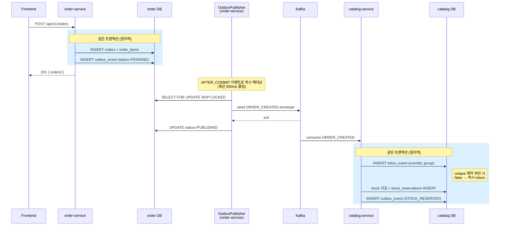

# 04_OUTBOX_INBOX_PATTERN — Transactional Outbox / Inbox 구현 스펙

> **목적**: Producer 측 dual-write 문제와 Consumer 측 중복 처리를 동시에 해결하는 Outbox + Inbox 패턴의 구현 스펙
> **선행 문서**: `00_MSA_RESILIENCE_GUIDE_KR.md`, `01_KAFKA_INFRASTRUCTURE_SPEC_KR.md`, `02_SAGA_ORDER_PAYMENT_SPEC_KR.md`
> **영향 범위**: `jym-order-service`, `jym-payment-service`, `jym-catalog-service`

---

## 1. 배경: 왜 Outbox + Inbox 가 필요한가

### 1.1 Saga 스펙(`02_*`) 구현 후 남아 있던 정합성 구멍

`02_SAGA_ORDER_PAYMENT_SPEC_KR.md` 의 구현은 비즈니스 트랜잭션 안에서 다음 두 가지를 동시에 수행했습니다.

1. 도메인 데이터를 `@Transactional` 로 DB 에 저장
2. `eventPublisher.publish(...)` 를 호출하여 Kafka 로 이벤트 발행

```java
// jym-order-service/.../OrderService.java (AS-IS)
@Transactional
public OrderResponse createOrder(...) {
    orderRepository.save(order);                 // DB
    cartRepository.save(emptiedCart);            // DB
    publishOrderCreatedEvent(savedOrder);        // Kafka  ← 별도 리소스
    return OrderResponse.from(savedOrder);
}
```

`kafkaTemplate.send(...)` 는 Spring 의 트랜잭션 매니저와 묶이지 않은 **별도 리소스** 이며, 호출 즉시 producer buffer 로 비동기 전송됩니다. 따라서 두 가지 정합성 시나리오가 발생할 수 있습니다.

#### 시나리오 A — DB commit ✅, Kafka 발행 ❌

```
1. order INSERT (트랜잭션 commit 완료)
2. publishOrderCreatedEvent → kafkaTemplate.send (비동기)
3. Kafka broker 일시 장애 → 메시지 유실
4. 발행 실패 로그만 남고 트랜잭션은 이미 commit 됨
결과: 주문은 DB 에 PENDING 으로 박혀있지만 catalog 가 재고예약을 트리거 받지 못함 → 영원히 PENDING 좀비 주문
```

#### 시나리오 B — Kafka 발행 ✅, DB rollback ❌

```
1. orderRepository.save (영속성 컨텍스트에 반영)
2. publishOrderCreatedEvent → kafkaTemplate.send (메시지 producer buffer 로 즉시 진입)
3. 트랜잭션 commit 직전 DB 장애 → 트랜잭션 rollback
4. Kafka 에는 이미 메시지가 발행되어 catalog 가 재고를 깎음
결과: 주문 row 는 DB 에 없는데 catalog 는 재고를 차감 → 유령 재고 차감
```

> 이 두 케이스는 같은 코드에서 동시에 위험하며, 이를 "**Dual Write Problem**" 이라 부릅니다.

### 1.2 같은 패턴이 발견된 추가 위치

| 위치 | 트랜잭션 + Kafka 발행 |
|---|---|
| `OrderService.createOrder` | DB save + `ORDER_CREATED` |
| `PaymentService.confirm` | Payment save + `PAYMENT_COMPLETED` / `PAYMENT_FAILED` |
| `PaymentService.cancel` | Payment 상태 변경 + `PAYMENT_CANCELLED` |
| `PaymentTimeoutScheduler.cancelTimedOutOrders` | Order CANCELLED + `ORDER_CANCELLED` |
| `StockEventConsumer.handleOrderCreated` | 재고 변경 + `STOCK_RESERVED` / `STOCK_RESERVATION_FAILED` |
| `OrderNotificationListener.onStatusChanged` (`AFTER_COMMIT`) | DB 갱신 후 `NOTI_ORDER_STATUS_CHANGED` 발행 |

특히 `PaymentService.confirm` 의 catch 블록은 더 위험합니다. **Toss API 는 이미 결제를 승인했는데** 로컬 DB 처리 중 예외가 발생하면 `PAYMENT_FAILED` 가 발행되면서 catalog 가 재고를 복원해버립니다. → 결제는 됐는데 재고는 풀린 상태.

### 1.3 Consumer 측: 중복 처리 위험

Outbox 도입으로 producer 는 **at-least-once** 발행이 됩니다 (재시도 로직 포함). Kafka 의 기본 보장도 at-least-once 입니다. 따라서 컨슈머는 같은 이벤트를 두 번 처리할 수 있고, 멱등성 보장이 필수입니다.

현재 코드는 "도메인 상태 기반 멱등성"(예: `order.getStatus() != PENDING` 이면 skip) 을 사용하지만, 케이스별로 빠뜨리기 쉽고 일반화돼 있지 않습니다. → **eventId 기반 일반 Inbox 도입** 필요.

---

## 2. 솔루션 개요

### 2.1 패턴 조합

| 패턴 | 역할 | 적용 위치 |
|---|---|---|
| **Transactional Outbox** | 도메인 데이터 + 발행 이벤트를 같은 DB 트랜잭션에 묶음 | 3개 서비스 모두 |
| **Polling Publisher** | `outbox_event` 의 PENDING 레코드를 Kafka 로 비동기 발행 | 3개 서비스 모두 |
| **AFTER_COMMIT 즉시 트리거** | 폴링 주기 대기 없이 commit 직후 즉시 발행 | 3개 서비스 모두 |
| **Inbox 멱등성 가드** | `(eventId, consumerGroup)` 으로 중복 처리 차단 | order, catalog (컨슈머 보유 서비스) |

### 2.2 전체 흐름 (예: 주문 생성)



### 2.3 보장 수준

| 보장 항목 | 어떻게 |
|---|---|
| **Producer 원자성** | 도메인 INSERT 와 outbox INSERT 가 같은 트랜잭션 → 둘 다 commit 되거나 둘 다 rollback |
| **At-least-once 발행** | Polling Publisher 가 PENDING 을 반복 발행. 일시적 Kafka 장애 시에도 결국 발행됨 |
| **Consumer 멱등성** | `(eventId, consumerGroup)` unique 제약 → 같은 이벤트 두 번째 처리는 INSERT 실패 → skip |
| **이벤트 순서 (per aggregate)** | `aggregateId` 를 Kafka partition key 로 사용 → 같은 주문의 이벤트는 같은 파티션 → 순서 유지 |
| **멀티 인스턴스 안전** | `SELECT ... FOR UPDATE SKIP LOCKED` (MySQL 8+) 로 같은 row 동시 처리 차단 |
| **재시도 한계** | **Exponential Backoff** + `next_retry_at` 컬럼. 30회 누적 실패(약 1.5시간 누적 대기) 시 `FAILED` 격리 → 운영자 수동 확인. 자세한 알고리즘은 §4.6 참조 |

> **Effectively Exactly-Once**: at-least-once 발행 + 멱등 컨슈머 = 결과적으로 한 번 처리된 효과.

---

## 3. 테이블 설계

각 서비스의 **자체 DB** 에 `outbox_event` 를 두며, 컨슈머가 있는 서비스(`order`, `catalog`)는 `inbox_event` 도 둡니다. Database-per-service 원칙을 그대로 유지합니다.

### 3.1 `outbox_event` 테이블

```sql
CREATE TABLE outbox_event (
    id              BIGINT       NOT NULL AUTO_INCREMENT,
    event_id        VARCHAR(36)  NOT NULL COMMENT 'UUID — EventEnvelope.eventId 와 동일',
    aggregate_type  VARCHAR(30)  NOT NULL COMMENT 'ORDER | PAYMENT | STOCK',
    aggregate_id    VARCHAR(100) NOT NULL COMMENT 'Kafka partition key (예: orderId 문자열)',
    topic           VARCHAR(100) NOT NULL COMMENT '대상 토픽 (jym.order.events 등)',
    event_type      VARCHAR(50)  NOT NULL COMMENT 'EventTypes 상수',
    payload         TEXT         NOT NULL COMMENT '내부 페이로드 JSON 직렬화 문자열',
    status          VARCHAR(15)  NOT NULL COMMENT 'PENDING | PUBLISHED | FAILED',
    retry_count     INT          NOT NULL DEFAULT 0,
    last_error      VARCHAR(1000) NULL,
    next_retry_at   DATETIME     NULL COMMENT 'Exponential backoff: NULL=즉시 처리 가능, 값이 있으면 그 시각 이후에만 폴링됨',
    created_at      DATETIME     NOT NULL,
    published_at    DATETIME     NULL,
    PRIMARY KEY (id),
    UNIQUE KEY idx_outbox_event_id (event_id),
    INDEX idx_outbox_status_id (status, id)
) COMMENT = '발행 대기 이벤트 (Transactional Outbox)';
```

| 컬럼 | 타입 | 제약 | 설명 |
|---|---|---|---|
| `id` | BIGINT | PK, AUTO_INCREMENT | Polling 순서 보장용 |
| `event_id` | VARCHAR(36) | NOT NULL, UNIQUE | UUID. Kafka 로 보낼 `EventEnvelope.eventId` 와 동일 값 |
| `aggregate_type` | VARCHAR(30) | NOT NULL | 추적/필터링용 (운영 관점) |
| `aggregate_id` | VARCHAR(100) | NOT NULL | Kafka partition key. 같은 주문의 이벤트 순서 보장 |
| `topic` | VARCHAR(100) | NOT NULL | 대상 토픽명 |
| `event_type` | VARCHAR(50) | NOT NULL | 예: `ORDER_CREATED`, `STOCK_RESERVED` |
| `payload` | TEXT | NOT NULL | 내부 페이로드만 JSON 직렬화 (envelope 메타는 컬럼에 분리) |
| `status` | VARCHAR(15) | NOT NULL | `PENDING` / `PUBLISHED` / `FAILED` |
| `retry_count` | INT | NOT NULL, DEFAULT 0 | 발행 실패 시 누적. 30회 도달 시 FAILED 격리 |
| `last_error` | VARCHAR(1000) | NULL | 마지막 실패 메시지 (앞 1000자) |
| `next_retry_at` | DATETIME | NULL | Exponential backoff. 폴링 쿼리에서 `NULL OR <= NOW()` 조건으로 필터됨. 새로 INSERT 되면 NULL → 즉시 처리. 발행 실패 시 다음 재시도 시각이 세팅됨. 자세한 계산식은 §4.6 |
| `created_at` | DATETIME | NOT NULL | INSERT 시점 |
| `published_at` | DATETIME | NULL | PUBLISHED 전환 시점 |

> **인덱스 설계 의도**:
> - `idx_outbox_status_id (status, id)`: Polling 쿼리 `WHERE status='PENDING' ORDER BY id ASC` 의 핵심 인덱스.
> - `idx_outbox_event_id`: UUID 충돌 방지 및 운영 시 추적용.

### 3.2 `inbox_event` 테이블

```sql
CREATE TABLE inbox_event (
    id             BIGINT       NOT NULL AUTO_INCREMENT,
    event_id       VARCHAR(36)  NOT NULL COMMENT '소비한 이벤트의 EventEnvelope.eventId',
    consumer_group VARCHAR(100) NOT NULL COMMENT 'KafkaListener groupId',
    event_type     VARCHAR(50)  NULL,
    topic          VARCHAR(100) NULL,
    partition_num  INT          NULL,
    offset_num     BIGINT       NULL,
    processed_at   DATETIME     NOT NULL,
    PRIMARY KEY (id),
    UNIQUE KEY uq_inbox_event_group (event_id, consumer_group)
) COMMENT = '소비 완료 이벤트 기록 (Inbox 멱등성)';
```

| 컬럼 | 타입 | 제약 | 설명 |
|---|---|---|---|
| `id` | BIGINT | PK, AUTO_INCREMENT | 보존정책 운영 용도 |
| `event_id` | VARCHAR(36) | NOT NULL, UNIQUE (with consumer_group) | 멱등성 키 |
| `consumer_group` | VARCHAR(100) | NOT NULL, UNIQUE (with event_id) | 같은 이벤트를 여러 그룹이 소비할 때 분리 |
| `event_type` / `topic` / `partition_num` / `offset_num` | - | NULL 가능 | 운영 시 추적 메타 |
| `processed_at` | DATETIME | NOT NULL | 처리 완료 시점 |

> **UNIQUE 키 설계 이유**: `(event_id, consumer_group)` 조합 unique 제약으로 두 번째 INSERT 가 `DataIntegrityViolationException` 을 던지게 만들어 멱등성을 DB 레벨에서 강제합니다.

---

## 4. 공통 컴포넌트 설계 (각 서비스 동일 구조로 복제)

각 서비스의 `event/outbox`, `event/inbox` 패키지에 동일 구조를 둡니다. 공유 모듈은 두지 않고 단순 복제로 의존성을 가볍게 유지합니다.

### 4.1 `OutboxEvent` 엔티티

핵심 도메인 메서드:

```java
public void markPublished() {
    this.status = OutboxStatus.PUBLISHED;
    this.publishedAt = LocalDateTime.now();
    this.lastError = null;
    this.nextRetryAt = null;
}

/**
 * 발행 실패 시 호출. retryCount 를 증가시키고 exponential backoff 으로
 * nextRetryAt 을 산정. retry_count 가 한계(30회)에 도달하면 FAILED 로 격리.
 * 그 외엔 PENDING 유지 → nextRetryAt 이후의 폴링 사이클에서 재시도.
 *
 * 자세한 알고리즘은 §4.6 참조.
 */
public void markFailed(String error) {
    this.retryCount++;
    this.lastError = truncate(error, MAX_ERROR_LENGTH);

    if (this.retryCount >= MAX_RETRY_BEFORE_FAILED) {
        this.status = OutboxStatus.FAILED;
        this.nextRetryAt = null;
        return;
    }
    long delaySeconds = Math.min(
            BASE_RETRY_DELAY_SECONDS * (1L << (this.retryCount - 1)),
            MAX_RETRY_DELAY_SECONDS
    );
    this.nextRetryAt = LocalDateTime.now().plusSeconds(delaySeconds);
}
```

### 4.2 `OutboxEventRepository` — SKIP LOCKED 쿼리

```java
public interface OutboxEventRepository extends JpaRepository<OutboxEvent, Long> {

    /**
     * MySQL 8+ 의 SKIP LOCKED 를 이용하여, 멀티 인스턴스 환경에서도
     * 같은 row 를 동시에 처리하지 않도록 합니다.
     *
     * <p><b>next_retry_at 필터</b>: NULL(첫 INSERT) 이거나 이미 지난 시각만 폴링 대상.
     * 발행 실패로 backoff 가 세팅된 row 는 nextRetryAt 이 도래할 때까지 자동 제외됩니다.</p>
     *
     * 본 메서드는 반드시 트랜잭션 안에서 호출되어야 하며,
     * 호출자가 같은 트랜잭션 안에서 status 를 갱신하고 commit 해야 락이 해제됩니다.
     */
    @Query(
            value = "SELECT * FROM outbox_event " +
                    "WHERE status = 'PENDING' " +
                    "  AND (next_retry_at IS NULL OR next_retry_at <= NOW()) " +
                    "ORDER BY id ASC " +
                    "LIMIT :limit " +
                    "FOR UPDATE SKIP LOCKED",
            nativeQuery = true
    )
    List<OutboxEvent> findPendingForUpdate(@Param("limit") int limit);
}
```

### 4.3 `OutboxEventRecorder` — 비즈니스 코드의 새 진입점

`EventPublisher.publish(...)` 직접 호출을 모두 이 컴포넌트로 대체합니다.

```java
@Component
@RequiredArgsConstructor
@Slf4j
public class OutboxEventRecorder {

    private final OutboxEventRepository outboxEventRepository;
    private final ObjectMapper objectMapper;
    private final ApplicationEventPublisher applicationEventPublisher;

    /**
     * 호출자의 트랜잭션에 합류하여 outbox row 를 INSERT 합니다.
     * 트랜잭션 없이 호출되면 즉시 예외를 던집니다 — 트랜잭션 보장이 필수이기 때문입니다.
     */
    @Transactional(propagation = Propagation.MANDATORY)
    public void record(String topic, String aggregateType, String aggregateId,
                       String eventType, Object payload) { ... }

    /**
     * 호출자의 트랜잭션이 롤백되어야 하는 경로(예: Toss API 는 성공했으나
     * 로컬 DB 처리에서 예외 발생)에서, outbox 만 별도 트랜잭션으로 기록할 때 사용합니다.
     */
    @Transactional(propagation = Propagation.REQUIRES_NEW)
    public void recordInNewTransaction(...) { ... }

    private void recordInternal(...) {
        String payloadJson = objectMapper.writeValueAsString(payload);
        OutboxEvent event = OutboxEvent.builder()
                .eventId(UUID.randomUUID().toString())
                .aggregateType(aggregateType)
                .aggregateId(aggregateId)
                .topic(topic)
                .eventType(eventType)
                .payload(payloadJson)
                .status(OutboxStatus.PENDING)
                .build();
        outboxEventRepository.save(event);

        // 트랜잭션 commit 직후 OutboxPublisher 를 한 번 깨워주기 위한 트리거.
        applicationEventPublisher.publishEvent(new OutboxEventRecorded());
    }

    /** 트랜잭션 commit 후 즉시 발행 트리거용 Spring ApplicationEvent. */
    public record OutboxEventRecorded() {}
}
```

> **`MANDATORY` 의 의미**: 호출자가 트랜잭션 없이 outbox 만 기록하려는 실수를 컴파일 단계가 아닌 런타임에서라도 막아 안전성을 강화합니다.

### 4.4 `OutboxPublisher` — Polling + AFTER_COMMIT 트리거

```java
@Component
@RequiredArgsConstructor
@Slf4j
public class OutboxPublisher {

    private final OutboxEventRepository outboxEventRepository;
    private final KafkaTemplate<String, Object> kafkaTemplate;
    private final ObjectMapper objectMapper;

    @Value("${spring.application.name}")        private String serviceName;
    @Value("${app.outbox.batch-size:100}")      private int batchSize;
    @Value("${app.outbox.kafka-send-timeout-ms:5000}") private long kafkaSendTimeoutMs;

    /** 한 인스턴스 안에서 폴링과 AFTER_COMMIT 트리거의 동시 실행 방지. */
    private final AtomicBoolean running = new AtomicBoolean(false);

    @Scheduled(fixedDelayString = "${app.outbox.poll-interval-ms:500}")
    public void pollAndPublish() { publishPending(); }

    /** 비즈니스 트랜잭션 commit 직후 한 번 깨워서 발행 지연을 줄입니다. */
    @TransactionalEventListener(phase = TransactionPhase.AFTER_COMMIT)
    public void onOutboxEventRecorded(OutboxEventRecorder.OutboxEventRecorded ignored) {
        publishPending();
    }

    @Transactional
    public void publishPending() {
        if (!running.compareAndSet(false, true)) return;
        try {
            List<OutboxEvent> batch = outboxEventRepository.findPendingForUpdate(batchSize);
            for (OutboxEvent event : batch) {
                publishOne(event);
            }
        } finally {
            running.set(false);
        }
    }

    private void publishOne(OutboxEvent event) {
        try {
            Object payloadObject = objectMapper.readValue(event.getPayload(), Object.class);
            EventEnvelope<Object> envelope = EventEnvelope.<Object>builder()
                    .eventId(event.getEventId())
                    .eventType(event.getEventType())
                    .version(1)
                    .timestamp(event.getCreatedAt())
                    .source(serviceName)
                    .payload(payloadObject)
                    .build();

            kafkaTemplate.send(event.getTopic(), event.getAggregateId(), envelope)
                    .get(kafkaSendTimeoutMs, TimeUnit.MILLISECONDS);   // 동기 전송 + 타임아웃

            event.markPublished();
        } catch (Exception e) {
            event.markFailed(e.getMessage());
            log.error("Outbox 발행 실패: eventId={}, retry={}", event.getEventId(), event.getRetryCount(), e);
        }
    }
}
```

> **`kafkaTemplate.send(...).get(timeout)`**: 동기 전송 + 타임아웃을 통해 단일 장애가 트랜잭션을 무한정 점유하는 것을 방지합니다.

### 4.5 `InboxEvent` + `InboxIdempotencyGuard`

```java
@Component
@RequiredArgsConstructor
@Slf4j
public class InboxIdempotencyGuard {

    private final InboxEventRepository inboxEventRepository;

    /**
     * 호출자의 트랜잭션에 합류(MANDATORY) — 컨슈머 트랜잭션 안에서만 호출해야 합니다.
     * 같은 (eventId, consumerGroup) 이 이미 처리됐으면 false 반환 → 호출자는 즉시 return.
     */
    @Transactional(propagation = Propagation.MANDATORY)
    public boolean tryMarkProcessed(String eventId, String consumerGroup,
                                     String eventType, ConsumerRecord<?, ?> record) {
        if (eventId == null || eventId.isBlank()) {
            log.warn("eventId 누락 — 멱등성 보장 불가, 처리 진행");
            return true;
        }
        InboxEvent inbox = InboxEvent.builder()
                .eventId(eventId).consumerGroup(consumerGroup).eventType(eventType)
                .topic(record.topic()).partitionNum(record.partition()).offsetNum(record.offset())
                .build();
        try {
            inboxEventRepository.saveAndFlush(inbox);
            return true;
        } catch (DataIntegrityViolationException e) {
            log.info("이미 처리된 이벤트, skip: eventId={}, group={}", eventId, consumerGroup);
            return false;
        }
    }
}
```

> **`saveAndFlush`**: 즉시 INSERT 를 강제하여 unique 제약 위반 예외가 트랜잭션 종료가 아닌 호출 시점에 발생하도록 만듭니다. 그래야 정확히 그 자리에서 catch 할 수 있습니다.

### 4.6 Retry & Backoff 정책 — Exponential Backoff with Cap

#### 배경: 단순 retry 카운트만 사용했을 때의 결함

초기 구현(`5회 즉시 재시도`)은 다음 결함이 있었습니다.

```
T+0ms     Kafka 일시 다운
T+0ms     [폴링] 발행 시도 → 실패 → retry=1, PENDING 유지
T+500ms   [폴링] 시도 → 실패 → retry=2
T+1000ms  [폴링] 시도 → 실패 → retry=3
T+1500ms  [폴링] 시도 → 실패 → retry=4
T+2000ms  [폴링] 시도 → 실패 → retry=5 → FAILED 격리
T+5초     Kafka 복구 → 이미 늦었음. 모든 row 가 FAILED.
```

**Kafka 가 5초만 멈춰도 그 사이의 모든 PENDING 이 FAILED 로 격리되는 문제**가 있었습니다. Outbox 패턴 도입의 핵심 목적(짧은 장애 자동 복구)이 무력화됩니다.

#### 알고리즘: Exponential Backoff with Cap

발행 실패 시 다음 재시도 시각을 다음 공식으로 산정합니다.

```
delaySeconds = min(BASE_RETRY_DELAY_SECONDS * 2^(retryCount - 1), MAX_RETRY_DELAY_SECONDS)
nextRetryAt  = now + delaySeconds
```

상수:

| 상수 | 값 | 의미 |
|---|---|---|
| `BASE_RETRY_DELAY_SECONDS` | 1 | 1차 실패 후 첫 재시도까지 대기 시간 |
| `MAX_RETRY_DELAY_SECONDS` | 300 (5분) | 무한 증가 방지용 상한 |
| `MAX_RETRY_BEFORE_FAILED` | 30 | 이 횟수에 도달하면 FAILED 격리 |

#### 실제 동작 예시

| retryCount | 계산 | 다음 시도까지 | 누적 대기 |
|---|---|---|---|
| 1 | 2^0 = 1초 | 1초 | 1초 |
| 2 | 2^1 = 2초 | 2초 | 3초 |
| 3 | 2^2 = 4초 | 4초 | 7초 |
| 4 | 2^3 = 8초 | 8초 | 15초 |
| 5 | 2^4 = 16초 | 16초 | 31초 |
| 6 | 2^5 = 32초 | 32초 | 63초 |
| 7 | 2^6 = 64초 | 64초 | 약 2분 |
| 8 | 2^7 = 128초 | 128초 | 약 4분 |
| 9 | 2^8 = 256초 | 256초 | 약 8.5분 |
| 10 | 2^9 = 512 → **cap 300** | 300초 | 약 13.5분 |
| 11~30 | cap 300 | 300초씩 | … 약 1시간 53분 |
| 30 | — | (FAILED 격리) | **약 113분 누적** |

→ 결과: **Kafka 가 1시간 이내로 복구되면 자동으로 발행되며, 정말 영구적 문제일 때만 FAILED 로 격리**됩니다.

#### 폴링 쿼리 통합

`next_retry_at` 컬럼은 폴링 쿼리에서 다음 조건으로 필터됩니다.

```sql
WHERE status = 'PENDING'
  AND (next_retry_at IS NULL OR next_retry_at <= NOW())
```

- 첫 INSERT 시: `next_retry_at = NULL` → 즉시 폴링 대상
- 실패 후: `next_retry_at = <미래 시각>` → 도래 전까지 자동 제외 → 자원 낭비 없음

#### 인덱스 고려사항

현재 인덱스 `(status, id)` 는 그대로 유지합니다. 이유:

- PENDING row 의 수가 적을 때(정상 시) `(status, id)` 로 충분히 좁혀짐
- `next_retry_at` 필터는 좁혀진 후 적용 → 비용 미미
- 만약 장애 누적으로 PENDING 이 대량 쌓이면 `(status, next_retry_at, id)` 로 인덱스 교체 고려 (§11 향후 개선 영역에 추가)

#### markFailed 의 트랜잭션 의미

`OutboxPublisher.publishOne` 의 catch 블록에서 호출되는 `markFailed` 는 `publishPending` 의 `@Transactional` 안에서 실행되어 같은 트랜잭션으로 commit 됩니다. 즉 **retry_count 증가와 next_retry_at 갱신이 원자적**으로 commit 되어, 한 row 가 동시에 여러 인스턴스에서 발행 시도되는 일이 없습니다(`FOR UPDATE SKIP LOCKED` 과 결합).

---

## 5. 서비스별 변경 사항

### 5.1 [jym-order-service/.../OrderService.java](../../../jym-order-service/src/main/java/jymusic/jym_order_service/service/OrderService.java)

`createOrder` 끝부분의 `publishOrderCreatedEvent(savedOrder)` 호출을 outbox 경유로 교체합니다.

**AS-IS:**
```java
@Transactional
public OrderResponse createOrder(...) {
    // ... 주문 저장, 카트 비우기 ...
    publishOrderCreatedEvent(savedOrder);    // kafkaTemplate.send 직접 호출
    return OrderResponse.from(savedOrder);
}
```

**TO-BE:**
```java
@Transactional
public OrderResponse createOrder(...) {
    // ... 주문 저장, 카트 비우기 ...
    recordOrderCreatedToOutbox(savedOrder);  // 같은 트랜잭션 안에서 outbox INSERT
    return OrderResponse.from(savedOrder);
}

private void recordOrderCreatedToOutbox(Order order) {
    OrderCreatedPayload payload = OrderCreatedPayload.builder()... .build();
    outboxEventRecorder.record(
            KafkaTopics.ORDER_EVENTS,
            "ORDER",
            order.getId().toString(),
            EventTypes.ORDER_CREATED,
            payload
    );
}
```

### 5.2 [jym-order-service/.../OrderEventConsumer.java](../../../jym-order-service/src/main/java/jymusic/jym_order_service/event/consumer/OrderEventConsumer.java)

각 `@KafkaListener` 진입부에 **Inbox 가드**를 추가합니다.

```java
private static final String CONSUMER_GROUP = "jym-order-service-group";

@KafkaListener(topics = KafkaTopics.STOCK_EVENTS, groupId = CONSUMER_GROUP)
@Transactional
public void handleStockEvent(ConsumerRecord<String, EventEnvelope<?>> record) {
    EventEnvelope<?> envelope = record.value();

    if (!inboxIdempotencyGuard.tryMarkProcessed(
            envelope.getEventId(), CONSUMER_GROUP, envelope.getEventType(), record)) {
        return;   // 이미 처리된 이벤트 → 즉시 종료
    }

    switch (envelope.getEventType()) {
        case EventTypes.STOCK_RESERVED            -> handleStockReserved(envelope);
        case EventTypes.STOCK_RESERVATION_FAILED  -> handleStockReservationFailed(envelope);
        // ...
    }
}
```

같은 패턴을 `handlePaymentEvent` 에도 적용합니다.

### 5.3 [jym-order-service/.../scheduler/PaymentTimeoutScheduler.java](../../../jym-order-service/src/main/java/jymusic/jym_order_service/scheduler/PaymentTimeoutScheduler.java)

타임아웃 주문 취소 시의 `ORDER_CANCELLED` 발행도 outbox 경유로 전환합니다.

```java
@Scheduled(fixedRate = 60000)
@Transactional
public void cancelTimedOutOrders() {
    for (Order order : timedOutOrders) {
        order.transitionTo(OrderStatus.CANCELLED);
        orderRepository.save(order);

        // 재고 복원용 ORDER_CANCELLED 이벤트를 Outbox 에 기록 (같은 트랜잭션)
        outboxEventRecorder.record(
                KafkaTopics.ORDER_EVENTS,
                "ORDER",
                order.getId().toString(),
                EventTypes.ORDER_CANCELLED,
                OrderCancelledPayload.builder()...build()
        );
    }
}
```

### 5.4 NOTIFICATION 이벤트 발행 체인 변경

기존 흐름은 다음과 같았습니다.

```
OrderEventConsumer (트랜잭션 안)
  → applicationEventPublisher.publishEvent(OrderStatusChangedDomainEvent)
  → OrderNotificationListener [@TransactionalEventListener(AFTER_COMMIT)]
     → NotificationService.publishOrderStatusChanged
        → eventPublisher.publish (Kafka 직접 호출)   ← dual write!
```

`AFTER_COMMIT` 단계에서 Kafka 발행이 실패하면 알림 이벤트가 영구 유실됩니다. 이를 막기 위해 **리스너를 트랜잭션 안으로 이동**시키고 outbox 를 사용합니다.

#### [OrderNotificationListener.java](../../../jym-order-service/src/main/java/jymusic/jym_order_service/listener/OrderNotificationListener.java)

**AS-IS:**
```java
@TransactionalEventListener(phase = TransactionPhase.AFTER_COMMIT)
public void onStatusChanged(OrderStatusChangedDomainEvent event) {
    notificationService.publishOrderStatusChanged(...);
}
```

**TO-BE:**
```java
/**
 * 이전 구현은 @TransactionalEventListener(AFTER_COMMIT) 으로 트랜잭션 commit 이후
 * Kafka 발행을 직접 수행했으나, 이는 "DB commit 성공 → Kafka 발행 실패" 케이스에서
 * 알림 이벤트가 유실되는 dual-write 문제가 있었습니다.
 *
 * 현재 구현은 동기 @EventListener 로 호출되어 호출자(예: OrderEventConsumer)의
 * 트랜잭션 안에서 outbox 에 INSERT 됩니다. 호출자 트랜잭션이 rollback 되면 outbox INSERT 도
 * 함께 rollback 되어 정합성이 보장됩니다.
 */
@EventListener
public void onStatusChanged(OrderStatusChangedDomainEvent event) {
    notificationService.publishOrderStatusChanged(...);
}
```

#### [NotificationService.java](../../../jym-order-service/src/main/java/jymusic/jym_order_service/notification/service/NotificationService.java)

```java
public void publishOrderStatusChanged(OrderStatusChangedNotiPayload payload) {
    if (broadcastViaKafka) {
        outboxEventRecorder.record(
                KafkaTopics.NOTIFICATION_EVENTS,
                "ORDER",
                String.valueOf(payload.getOrderId()),
                EventTypes.NOTI_ORDER_STATUS_CHANGED,
                payload
        );
        return;
    }

    // 단일 인스턴스 모드(브로드캐스트 비활성): SSE 직접 푸시
    registry.sendToMember(payload.getMemberId(), EventTypes.NOTI_ORDER_STATUS_CHANGED, ...);
}
```

### 5.5 [jym-payment-service/.../PaymentService.java](../../../jym-payment-service/src/main/java/jymusic/jym_payment_service/service/PaymentService.java)

`confirm()` / `cancel()` 의 3개 발행점을 모두 outbox 경유로 전환합니다. 특히 **`confirm` 의 catch 블록은 본 트랜잭션이 rollback** 되므로 반드시 `recordInNewTransaction(REQUIRES_NEW)` 을 사용해야 합니다.

```java
@Transactional
public PaymentConfirmResponse confirm(Long memberId, PaymentConfirmRequest request) {
    // ... prepare 조회, 금액 검증 ...
    try {
        TossPaymentsClient.TossConfirmResult tossResult = tossClient.confirmPayment(...);
        // ... Payment 저장, prepare 삭제 ...

        // 성공 경로 — 본 트랜잭션에 합류
        outboxEventRecorder.record(
                KafkaTopics.PAYMENT_EVENTS, "PAYMENT",
                request.getOrderId().toString(),
                EventTypes.PAYMENT_COMPLETED,
                PaymentCompletedPayload.builder()...build()
        );
        return PaymentConfirmResponse.from(savedPayment);

    } catch (GlobalException e) {
        // 본 트랜잭션은 throw 로 인해 롤백되므로 outbox INSERT 는
        // 반드시 별도 트랜잭션(REQUIRES_NEW)으로 commit 시켜야 한다.
        outboxEventRecorder.recordInNewTransaction(
                KafkaTopics.PAYMENT_EVENTS, "PAYMENT",
                request.getOrderId().toString(),
                EventTypes.PAYMENT_FAILED,
                PaymentFailedPayload.builder()...build()
        );
        throw e;
    }
}
```

`cancel()` 도 같은 패턴으로 outbox 경유로 전환합니다.

> **payment-service 는 컨슈머가 없습니다** → Inbox 는 도입하지 않습니다.

### 5.6 [jym-catalog-service/.../StockEventConsumer.java](../../../jym-catalog-service/src/main/java/jymusic/jym_catalog_service/event/consumer/StockEventConsumer.java)

가장 복잡한 변경 — **컨슈머이자 프로듀서**이기 때문에 양방향 모두 적용합니다.

```java
private static final String CONSUMER_GROUP = "jym-catalog-service-group";

@KafkaListener(topics = KafkaTopics.ORDER_EVENTS, groupId = CONSUMER_GROUP)
@Transactional
public void handleOrderEvent(ConsumerRecord<String, EventEnvelope<?>> record) {
    EventEnvelope<?> envelope = record.value();

    // ① 진입부 Inbox 가드
    if (!inboxIdempotencyGuard.tryMarkProcessed(
            envelope.getEventId(), CONSUMER_GROUP, envelope.getEventType(), record)) {
        return;
    }

    switch (envelope.getEventType()) {
        case EventTypes.ORDER_CREATED   -> handleOrderCreated(envelope);
        case EventTypes.ORDER_CANCELLED -> handleOrderCancelled(envelope);
        // ...
    }
}

private void handleOrderCreated(EventEnvelope<?> envelope) {
    // ... 재고 차감, stock_reservations 저장 ...

    // ② STOCK_RESERVED / STOCK_RESERVATION_FAILED 발행은 outbox 경유
    outboxEventRecorder.record(
            KafkaTopics.STOCK_EVENTS, "STOCK",
            payload.getOrderId().toString(),
            EventTypes.STOCK_RESERVED,
            StockReservedPayload.builder()...build()
    );
}
```

이로써 catalog 의 한 트랜잭션 안에 **`inbox_event` INSERT + 재고 변경 + `stock_reservations` 저장 + `outbox_event` INSERT** 가 모두 묶입니다.

### 5.7 패키지 구조

```
jym-order-service/src/main/java/jymusic/jym_order_service/event/
├── common/         (기존)
├── consumer/       (기존)
├── payload/        (기존)
├── publisher/      (기존, but now Outbox 전용)
├── outbox/         ← NEW
│   ├── OutboxStatus.java
│   ├── OutboxEvent.java
│   ├── OutboxEventRepository.java
│   ├── OutboxEventRecorder.java
│   └── OutboxPublisher.java
└── inbox/          ← NEW
    ├── InboxEvent.java
    ├── InboxEventRepository.java
    └── InboxIdempotencyGuard.java
```

`payment-service` 는 같은 구조에서 `inbox/` 가 없고, `catalog-service` 는 동일 구조입니다.

---

## 6. EventPublisher 사용 정책

```java
/**
 * Kafka 이벤트 발행 유틸리티.
 *
 * <p><b>중요</b>: 비즈니스 코드에서 직접 호출하지 마세요.
 * 도메인 데이터와 발행 이벤트의 정합성(dual-write 방지)을 위해
 * 반드시 {@code OutboxEventRecorder.record(...)} 를 사용하세요.
 * 이 클래스는 {@code OutboxPublisher} 가 outbox row 를 발행할 때만 사용합니다.</p>
 */
@Component
@RequiredArgsConstructor
public class EventPublisher { ... }
```

- 기존 `EventPublisher.publish(...)` 직접 호출은 **모두 `OutboxEventRecorder.record(...)` 로 교체** 되었습니다.
- `EventPublisher` 클래스 자체는 보존합니다 — 이제부터는 `OutboxPublisher` 만이 내부에서 사용하는 인프라 유틸리티입니다.

---

## 7. 설정

`application.yml` / `application-*.properties` 는 의도적으로 `.gitignore` 되어 있으므로 신규 생성하지 않고, 코드의 `@Value("${key:default}")` 인라인 기본값으로 안전한 운영 디폴트를 제공합니다.

| 키 | 기본값 | 설명 |
|---|---|---|
| `app.outbox.poll-interval-ms` | `500` | Polling 주기 (ms) |
| `app.outbox.batch-size` | `100` | 한 폴 사이클당 처리 row 수 |
| `app.outbox.kafka-send-timeout-ms` | `5000` | 동기 send 의 타임아웃 |

운영 환경에서 튜닝이 필요하면 각 서비스의 (gitignored) `application-*.properties` 에 override 합니다.

또한 `payment-service`, `catalog-service` 의 `Application` 클래스에 `@EnableScheduling` 을 추가했습니다 (`order-service` 는 이미 적용되어 있었음).

---

## 8. 수동 검증 시나리오

`docker-compose -f docker-compose-dev.yml up` 후 다음 시나리오를 실행해 정합성을 직접 확인할 수 있습니다.

### 8.1 (a) 정상 흐름

```
1. POST /api/v1/orders
2. SELECT id, event_type, status FROM outbox_event ORDER BY id DESC LIMIT 5;
   → PENDING 1건 INSERT 즉시 관측
3. 약 500ms 내(보통은 AFTER_COMMIT 트리거로 즉시) PUBLISHED 로 전환
4. catalog DB: SELECT * FROM inbox_event WHERE consumer_group='jym-catalog-service-group';
   → 같은 eventId 가 INSERT 되어 있어야 함
```

### 8.2 (b) Kafka 일시 중단 → 재기동

→ **시나리오 A (DB commit ✅ / Kafka 발행 ❌) 가 해소되었는지 확인**

```
1. docker stop jym-kafka
2. POST /api/v1/orders   → 200 OK (트랜잭션은 commit, outbox PENDING 누적)
3. 로그에 "Outbox 발행 실패: ... retry=1, 2, 3..." 누적, retry_count 증가
4. docker start jym-kafka
5. 다음 폴 사이클에서 자동으로 PUBLISHED 로 전환되어야 함
6. catalog 가 정상 소비, 재고 차감 완료
```

### 8.3 (c) 중복 이벤트 차단

→ **컨슈머 멱등성 확인**

```
방법 1: Kafka UI 에서 같은 메시지를 같은 토픽에 두 번 produce
방법 2: catalog-service 재기동 (offset reset) 후 ORDER_CREATED 를 다시 받게 함

기대 동작:
  - 두 번째 처리에서 InboxIdempotencyGuard 의 saveAndFlush 가 DataIntegrityViolationException
  - "이미 처리된 이벤트, skip: eventId=..." 로그 출력
  - 재고가 두 번 깎이지 않음
```

### 8.4 (d) PaymentService.confirm catch 블록 검증 (선택)

→ **`REQUIRES_NEW` 가 제대로 동작하는지 확인**

```
1. PaymentService.confirm 의 Toss 호출 직후에 일시적으로 throw new RuntimeException("force rollback") 삽입
2. /payments/confirm 호출 → 500 에러 (본 트랜잭션 rollback)
3. payment DB 의 outbox_event 에 PAYMENT_FAILED 가 1건 INSERT 되어 있어야 함
   (본 트랜잭션은 rollback 됐지만 REQUIRES_NEW 로 별도 commit 됐기 때문)
4. catalog 가 PAYMENT_FAILED 를 소비하여 재고 복원
```

---

## 9. 트레이드오프 및 한계

| 항목 | 내용 |
|---|---|
| **발행 지연** | 폴 주기(기본 500ms)만큼의 추가 지연. `AFTER_COMMIT` 트리거로 보통 즉시 발행되지만 보장은 아님. |
| **순서 보장** | 같은 `aggregateId` 는 같은 partition 으로 보내므로 **per-aggregate 순서**만 보장. 서로 다른 aggregate 간 전역 순서는 보장하지 않음 (Kafka 의 표준 보장 수준과 동일). |
| **`SELECT FOR UPDATE` 부하** | MySQL row-level lock 사용. 대량의 outbox row 가 PENDING 으로 쌓이면 락 경합 증가 → batch-size 와 poll-interval 튜닝 필요. |
| **outbox 테이블 누적** | PUBLISHED row 가 영구 누적됨. 운영 보존 정책(예: 7일 이상 삭제 batch) 은 후속 개선 영역. 학습 프로젝트 1차 도입 범위에는 미포함. |
| **Backoff 누적 시간** | Exponential Backoff 최대 누적 약 113분(§4.6). 그보다 긴 장애에서는 FAILED 격리 후 수동 복구 필요. 운영 환경에서는 FAILED row 모니터링/알림 연동 권장. |
| **Clock skew (멀티 인스턴스)** | `nextRetryAt` 계산은 발행 인스턴스의 `LocalDateTime.now()`, 폴링 필터는 MySQL `NOW()` 기준. 두 시계가 어긋나면 backoff 가 의도보다 짧거나 길어질 수 있음. NTP 동기화로 충분히 무시 가능한 수준. |
| **`PaymentService.confirm` catch 블록** | 본 트랜잭션 rollback 후 별도 트랜잭션으로 outbox INSERT — 이 INSERT 자체가 실패하면 PAYMENT_FAILED 가 발행되지 않음. 다만 본 트랜잭션 rollback 으로 Payment row 자체가 없으므로, 추후 동일 paymentKey 로 재시도 시 자연스럽게 복구 가능. |
| **Inbox 보존** | inbox 도 보존정책 필요. 단, 멱등성 키이므로 너무 빨리 삭제하면 중복 차단 실패. retention 기간은 Kafka 메시지 보존(기본 7일) + 안전 마진으로 설정 권장. |

---

## 10. 테스트 전략

### 10.1 단위 테스트 — OutboxEventRecorder

```java
@ExtendWith(MockitoExtension.class)
class OutboxEventRecorderTest {

    @Mock OutboxEventRepository repository;
    @Mock ObjectMapper objectMapper;
    @Mock ApplicationEventPublisher applicationEventPublisher;
    @InjectMocks OutboxEventRecorder recorder;

    @Test
    void record_savesOutboxEventWithPendingStatus() {
        // given
        OrderCreatedPayload payload = ...;
        given(objectMapper.writeValueAsString(payload)).willReturn("{...}");

        // when (트랜잭션 컨텍스트는 MANDATORY 이지만 단위 테스트는 직접 호출 검증)
        recorder.record("jym.order.events", "ORDER", "1", "ORDER_CREATED", payload);

        // then
        ArgumentCaptor<OutboxEvent> captor = ArgumentCaptor.forClass(OutboxEvent.class);
        verify(repository).save(captor.capture());
        OutboxEvent saved = captor.getValue();
        assertThat(saved.getStatus()).isEqualTo(OutboxStatus.PENDING);
        assertThat(saved.getEventId()).isNotBlank();
        verify(applicationEventPublisher).publishEvent(any(OutboxEventRecorded.class));
    }
}
```

### 10.2 단위 테스트 — InboxIdempotencyGuard

```java
@Test
void tryMarkProcessed_returnsFalseOnDuplicate() {
    given(inboxEventRepository.saveAndFlush(any()))
            .willThrow(new DataIntegrityViolationException("uq violation"));

    boolean result = guard.tryMarkProcessed("uuid-1", "group", "ORDER_CREATED", record);

    assertThat(result).isFalse();
}

@Test
void tryMarkProcessed_returnsTrueOnFirstSave() {
    given(inboxEventRepository.saveAndFlush(any())).willReturn(new InboxEvent(...));

    boolean result = guard.tryMarkProcessed("uuid-1", "group", "ORDER_CREATED", record);

    assertThat(result).isTrue();
}
```

### 10.3 통합 테스트 — Polling Publisher

```java
@SpringBootTest
@EmbeddedKafka(topics = { KafkaTopics.ORDER_EVENTS })
class OutboxPublisherIntegrationTest {

    @Test
    void publishPending_sendsToKafkaAndMarksPublished() {
        outboxEventRepository.save(OutboxEvent.builder()
                .eventId(UUID.randomUUID().toString())
                .aggregateType("ORDER").aggregateId("1")
                .topic(KafkaTopics.ORDER_EVENTS)
                .eventType("ORDER_CREATED")
                .payload("{}")
                .status(OutboxStatus.PENDING)
                .build());

        outboxPublisher.publishPending();

        OutboxEvent updated = outboxEventRepository.findAll().get(0);
        assertThat(updated.getStatus()).isEqualTo(OutboxStatus.PUBLISHED);
        assertThat(updated.getPublishedAt()).isNotNull();
    }
}
```

### 10.4 통합 테스트 — Inbox 멱등성

```java
@Test
void duplicateConsume_skippedByInbox() {
    String eventId = UUID.randomUUID().toString();
    EventEnvelope<?> envelope = buildEnvelope(eventId, ...);

    stockEventConsumer.handleOrderEvent(record(envelope));   // 1st
    stockEventConsumer.handleOrderEvent(record(envelope));   // 2nd — should skip

    // 재고가 한 번만 차감됐는지 검증
    Product product = productRepository.findById(1L).orElseThrow();
    assertThat(product.getStockQuantity()).isEqualTo(INITIAL_STOCK - 1);
}
```

---

## 11. 향후 개선 영역

| 항목 | 설명 |
|---|---|
| **outbox/inbox 보존 정책** | `created_at` < `now() - 7days` AND `status = PUBLISHED` 인 row 를 주기적으로 삭제하는 batch 스케줄러 |
| **CDC 기반 발행으로 진화** | Polling 부담이 커지면 Debezium 으로 binlog 기반 발행으로 교체. outbox 테이블 스키마는 그대로 유지 가능 |
| **공통 모듈 추출** | 동일 구조가 3개 서비스에 복제되어 있음. 향후 `jym-common` Gradle 모듈로 추출하여 중복 제거 |
| **DLT 연동** | outbox `FAILED` 격리 row 를 별도 DLT 로 발행하여 운영 알림 (Slack/이메일) |
| **NotificationEventConsumer 에 Inbox 적용** | 현재는 SSE 푸시만 하므로 미적용. 중복 SSE 푸시가 사용자 경험을 해친다고 판단되면 적용 |
| **Outbox 인덱스 교체** | 장애 누적으로 PENDING 이 대량 쌓이는 운영 환경에서는 `(status, id)` → `(status, next_retry_at, id)` 로 교체 고려 (§4.6) |
| **FAILED row 운영 알림** | Outbox `FAILED` 또는 `retry_count >= N` 인 row 가 발생하면 Slack/PagerDuty 등으로 알림 — DLT 연동 항목과 같이 묶일 수 있음 |

---

## 12. 변경 파일 요약

### 12.1 신규 파일 (총 14개)

```
jym-order-service/.../event/outbox/
  OutboxStatus.java
  OutboxEvent.java
  OutboxEventRepository.java
  OutboxEventRecorder.java
  OutboxPublisher.java
jym-order-service/.../event/inbox/
  InboxEvent.java
  InboxEventRepository.java
  InboxIdempotencyGuard.java

jym-payment-service/.../event/outbox/   (Outbox 5개 파일, Inbox 없음)

jym-catalog-service/.../event/outbox/   (Outbox 5개 + Inbox 3개)
```

### 12.2 변경 파일

| 파일 | 변경 요지 |
|---|---|
| `OrderService.java` | `publishOrderCreatedEvent` → `outboxEventRecorder.record` |
| `OrderEventConsumer.java` | `handleStockEvent` / `handlePaymentEvent` 진입부에 Inbox 가드 |
| `PaymentService.java` | `confirm`/`cancel` 3개 발행점을 outbox 경유. catch 블록은 `recordInNewTransaction` |
| `StockEventConsumer.java` | Inbox 가드 + `STOCK_RESERVED` / `STOCK_RESERVATION_FAILED` 발행을 outbox 경유 |
| `PaymentTimeoutScheduler.java` | `ORDER_CANCELLED` 발행을 outbox 경유 |
| `NotificationService.java` | Kafka 발행 경로를 outbox 경유로 전환 |
| `OrderNotificationListener.java` | `@TransactionalEventListener(AFTER_COMMIT)` → `@EventListener` (트랜잭션 내 동기) |
| `EventPublisher.java` (3개 서비스) | "직접 호출 금지, OutboxPublisher 전용" javadoc 명시 |
| `JymPaymentServiceApplication.java` | `@EnableScheduling` 추가 |
| `JymCatalogServiceApplication.java` | `@EnableScheduling` 추가 |

### 12.3 후속 변경 — Exponential Backoff 도입 (§4.6)

초기 5회 즉시 재시도 정책이 짧은 Kafka 장애에도 PENDING row 를 즉시 FAILED 로 격리시키는 결함이 발견되어, exponential backoff 로 개선.

| 파일 | 변경 요지 |
|---|---|
| `OutboxEvent.java` (3개 서비스) | `next_retry_at` 컬럼 추가, `BASE_RETRY_DELAY_SECONDS=1` / `MAX_RETRY_DELAY_SECONDS=300` 상수 추가, `MAX_RETRY_BEFORE_FAILED` 5 → 30, `markFailed` 에 backoff 계산 로직, `markPublished` 에서 `nextRetryAt` 초기화 |
| `OutboxEventRepository.java` (3개 서비스) | 폴링 native 쿼리에 `AND (next_retry_at IS NULL OR next_retry_at <= NOW())` 조건 추가 |

---

_이 문서는 `02_SAGA_ORDER_PAYMENT_SPEC_KR.md` 의 Saga 흐름 위에 Producer/Consumer 양측의 정합성 구멍을 보완하기 위한 패턴 스펙입니다._
_상위 가이드는 `00_MSA_RESILIENCE_GUIDE_KR.md`, Kafka 인프라 설계는 `01_KAFKA_INFRASTRUCTURE_SPEC_KR.md` 를 참고하세요._
